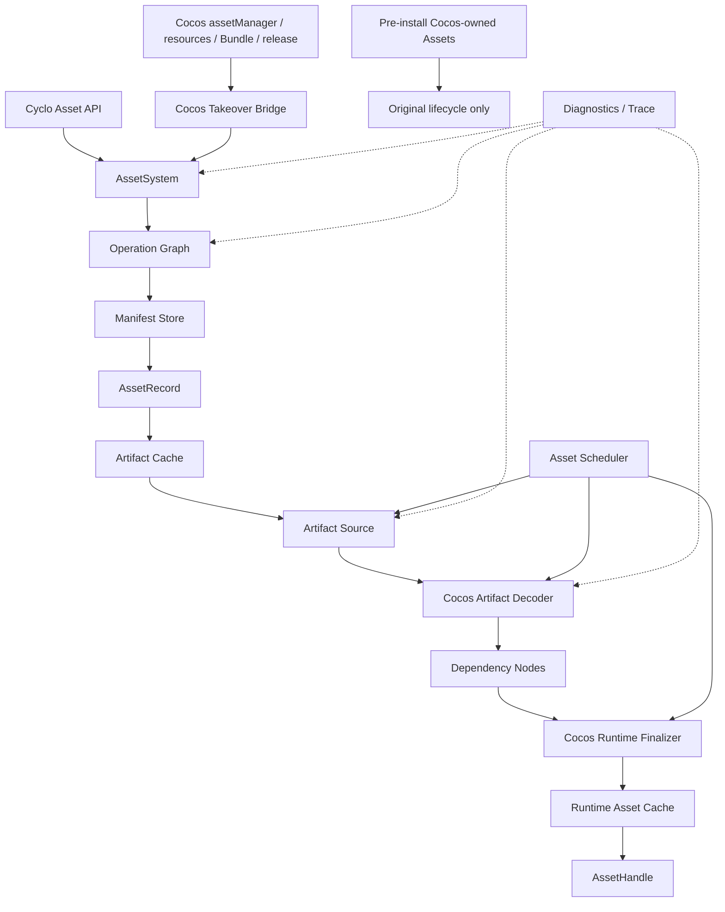
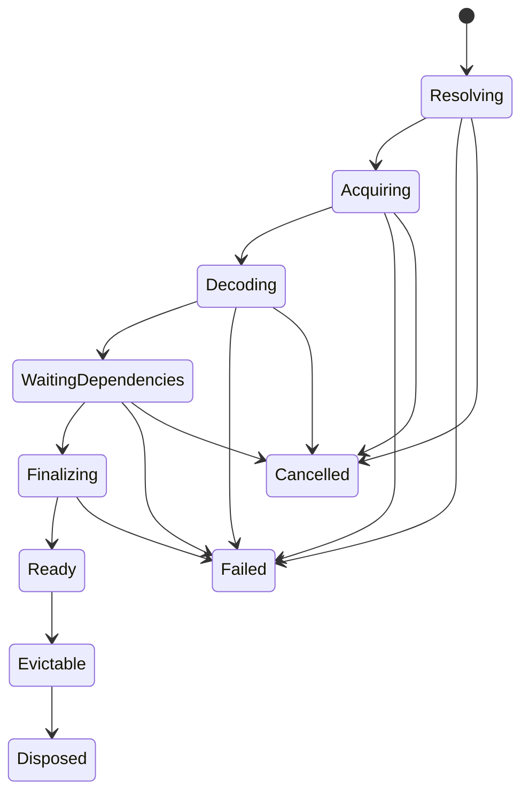

# Cyclo Asset Pipeline 规划

> 状态：架构讨论稿
> 日期：2026-07-25
> 当前宿主：Cocos Creator / Vortex Engine 4.0.0-alpha.23

## 1. 为什么重做

### 1.1 当前 Cocos Asset Pipeline 的核心痛点

以下判断针对当前宿主 `Vortex Engine 4.0.0-alpha.23` 中的 Cocos AssetManager 实现，不泛化为对所有历史或未来 Cocos 版本的判断。

#### 痛点一：HTTP 获取仍以 XHR 为基础

当前 Web 文件下载入口直接创建 `XMLHttpRequest`。这不只是 API 风格偏好：

- Web 与现代 Node 无法共享同一套标准传输语义
- Node 需要额外适配，而现代 Node 已经提供标准 `fetch`
- `Request`、`Response`、`Headers`、`AbortSignal` 和流式响应无法成为管线的一等模型
- 传输层细节通过 `xhrResponseType` 等动态 options 泄漏到资源管线

Cyclo 目标：

- HTTP Source 以 Fetch 标准语义为基础
- Web 和现代 Node 的远程获取共享实现；Node 本地文件由独立 File Source 处理
- 获取结果统一为明确类型的 Artifact，不把 XHR 对象泄漏到上层
- Native、小游戏等不能直接使用标准 Fetch 的环境实现显式 `ArtifactSource`，而不是修改全局下载器

#### 痛点二：没有贯穿整条加载 Operation 的 Abort 机制

XHR 和 Fetch 本身都能中止请求，但当前 AssetManager 公共加载 API 不接受 `AbortSignal`，`Task` 也没有可传播到下载、解码和依赖加载的取消契约。底层传输“理论上能 abort”不等于资源加载 Operation 可取消。

Cyclo 目标：

- 每个调用者通过 `AbortSignal` 表达自己的取消意图
- 下载、依赖等待、Decode 和 Finalize 在各自可中止的边界响应取消
- 合并加载时，取消一个调用者不破坏其他调用者
- 只有最后一个消费者退出时，才中止仍可中止的共享底层工作
- 取消是明确的终态和结构化错误，不伪装成普通加载失败

#### 痛点三：公共 API 仍以 Callback 为主

`loadAny`、`preloadAny`、`loadRemote`、`loadBundle` 以及 Bundle 加载 API 都以 callback 交付结果并返回 `void`。这使组合、错误传播、并发控制和结构化清理都更困难。

Cyclo 目标：

- 新 API Promise-first
- `AssetHandle.ready` 提供明确的异步结果
- 并发、超时、取消和错误通过标准异步语义组合
- Callback 只存在于 Cocos Takeover Bridge，用于兼容旧调用点，不进入 Cyclo 核心

#### 痛点四：关键管线状态大量使用 `any`

当前 `Task` 的 input、output、progress、options，以及 `RequestItem` 的 content、file 等核心字段使用 `any` 或开放字典。不同阶段只能靠约定猜测值当前是什么，类型错误会推迟到运行时暴露。

Cyclo 目标：

- 公共入口直接接收 `AssetId`，调用者通过 `load<T>()` 显式标注期望类型
- Resolve、Acquire、Decode、Link、Finalize、Publish 各阶段使用不同的输入输出类型
- 未类型化的 Cocos ABI 边界先接为 `unknown`，校验和收窄后才能进入核心
- 不设计 `Pipeline<any, any>`，也不使用魔法 options 在阶段间传递隐藏状态

#### 痛点五：引用计数不能完整表达资源所有权

Cocos 已有 `Asset.addRef()` / `decRef()`，但它本质上是 Asset 上的手工标量计数，再由 ReleaseManager 推导依赖释放。它没有完整表达：

- 哪个调用者正在使用资源
- 哪个 Scene、UI 或 Feature 生命周期拥有资源
- 依赖图为何仍然保留资源
- Cache 驻留与实际使用是否是同一件事
- 共享加载中某个消费者取消后应该释放什么

Cyclo 目标：

- 用户通过 `AssetHandle` 和 `AssetScope` 表达所有权
- consumer lease、dependency lease 和 cache residency 分开记录
- 引用计数可以作为内部实现细节，但不再是用户手工维持正确性的主要 API
- 每个未释放资源都能诊断出具体 owner 和 dependency path

#### 痛点六：多平台适配依靠修改运行时 AssetManager

当前 Node、Runtime 和小游戏平台适配会在运行时注册 downloader / parser、追加 transform pipeline stage，部分实现还会覆盖 `cc.assetManager.init`。平台差异因此表现为对共享全局管线的 Patch。

Cyclo 目标：

- 平台能力在组合根中显式选择
- HTTP、File、小游戏缓存等差异由 `ArtifactSource` 表达
- 平台 artifact 格式差异由 Decoder 或明确的 artifact selection policy 表达
- 新增平台不修改全局 Pipeline，不依赖加载顺序正确地执行一组 Hook
- Cocos Takeover Bridge 的 Hook 只用于接管当前宿主，不承担 Cyclo 自身的多平台抽象

#### 痛点七：Bundle 把分发边界与文件夹组织绑在一起

Cocos Bundle 同时承担资源命名空间、构建分组、远程分发和加载入口；当前作者工作流又以资源文件夹作为 Bundle 边界。其结果是：

- 调整分包可能迫使资源移动目录
- 目录组织同时承受代码可读性和发布策略两种不相干的压力
- 跨 Bundle 依赖容易让分包边界失真
- Bundle 名逐渐渗透业务 API，后续重组成本高
- “资源在哪里”与“资源随哪一包交付”无法独立演化

Cyclo 目标：

- `AssetId` 与源文件路径、Bundle 名和发布地址解耦
- 由 Manifest 的 delivery group 决定资源如何打包和交付
- delivery group 可以通过资源元数据、构建规则或显式清单生成，不要求移动源文件
- 依赖闭包在构建期计算并校验，跨组依赖是明确数据
- Cocos Bundle 只作为旧 API 兼容输入，不进入 Cyclo 核心领域模型
- Address、Label、Catalog 等更高层能力以后建立在这套 Manifest 之上

### 1.2 本地实现证据

相对于 `vortex-engine` 仓库：

- `cocos/asset/asset-manager/download-file.ts:32-33`：文件下载返回 `XMLHttpRequest` 并直接 `new XMLHttpRequest()`
- `cocos/asset/asset-manager/asset-manager.ts:552-562`：`loadAny` overload 以 callback 交付 `any`，返回 `void`
- `cocos/asset/asset-manager/task.ts:26-31`、`:106-175`：Task 的 callback、input、output、progress、options 使用大量 `any`
- `cocos/asset/asset-manager/request-item.ts:122-167`：content、file 和 options 缺乏阶段类型
- `cocos/asset/assets/asset.ts:301-333`：公开所有权能力是手工 `refCount`、`addRef()`、`decRef()`
- `cocos/serialization/ccon.ts:86-143`：CCONB 校验 header 后解码为 `document + chunks`
- `cocos/asset/asset-manager/pack-manager.ts:130-145`：binary pack 先切分 entry，再逐项执行 `decodeCCONBinary`
- `cocos/asset/asset-manager/asset-manager.ts:649-668` 与 `factory.ts:42-80`：`loadRemote` 按 URL 扩展名创建 ImageAsset、JsonAsset 等运行时对象
- `platforms/nodejs/engine/asset-manager.js:215`、`:360`、`:379-382`：Node 适配注册 handler、追加 pipeline 并覆盖 `assetManager.init`
- `platforms/runtime/common/engine/asset-manager.js:258`、`:321`、`:394`、`:413-415`：Runtime 适配采取同类运行时修改
- Bundle 与文件夹的作者工作流约束来自当前项目使用经验；Runtime 侧 `cocos/asset/asset-manager/downloader.ts:101-110` 也把 Bundle 名直接映射到 `assets/<bundleName>` 或远程目录

这些证据用来定义需要消除的耦合，不要求 Cyclo 逐个仿制 Cocos 内部类型。

### 1.3 结论

Cyclo 希望重新提供一套资源加载管线，最终尽可能接管业务代码和 Cocos 引擎内部发起的所有资源加载，而不只是向用户提供一套并行的新 API。

当前阶段不修改 `vortex-engine`，也不试图替换 `cc.Asset`、`cc.Texture2D`、`cc.Prefab` 等运行时对象。Cyclo 负责资源的定位、获取、依赖调度、缓存、生命周期和诊断，Cocos 继续负责运行时对象、序列化 ABI、渲染、音频等引擎能力。

目标形态是：

```text
业务代码 ─────────────────────┐
                             │
Cocos 引擎内部资源请求 ───────┼──> Cocos Takeover Bridge
                             │              ↓
Cocos 兼容 API ──────────────┘       Cyclo AssetSystem
                                            ↓
                           Operation / Graph / Cache / Scheduler
                                            ↓
                                Cocos Decoder / Finalizer
                                            ↓
                                         cc.Asset
```

Cyclo 仍然提供新的显式 API，但新 API 不是唯一入口。安装接管层之后，仍然调用 `assetManager`、`resources`、`Bundle`，以及引擎内部静态 import AssetManager 的代码，也应尽可能被路由到 Cyclo。

Hook 安装之前已经发生的启动资源加载无法追溯接管。原 Cocos AssetManager 可以作为这部分早期资源的兼容孤岛继续存在，但所有无法接管的入口必须被枚举和观测，不能用“引擎内部调用”笼统排除。

第一阶段允许使用少量、集中、受控的运行时 Hook，包括必要时修改实例方法或 `prototype`。目标不是零入侵，而是用最小入侵获得最大接管覆盖率。

用户侧的预期启动方式只有一行：

```ts
installCycloneAssetPipeline()
```

这行调用是正式开启 Patch 和建立接管时间边界的唯一入口。它不是只切换业务 API，而是安装 Takeover Bridge，使安装后来自业务代码和 Cocos 内部的受支持资源请求共同进入 Cyclo。

Cyclo AssetSystem 本身仍保持干净：

```text
Takeover Bridge
    ↓
Cyclo Operation / Graph / Cache / Scheduler
    ↓
Cyclo Cocos Decoder / Finalizer
    ↓
cc.Asset
```

## 2. 已确定的架构决策

### 2.1 当前直接依赖 `cc.Asset`

第一版公共类型可以直接表达为：

```ts
load<T extends cc.Asset>(id: AssetId, options?: LoadOptions): AssetHandle<T>
```

目前不创建只用于包裹 `cc.Asset` 的 `IAsset`、`RuntimeAssetAdapter` 或虚构的多引擎抽象。

需要隔离的不是 `cc.Asset` 类型本身，而是以下 Cocos AssetManager 语义：

- Cocos `Pipeline`、`Task`、`RequestItem`
- 全局 `assets`、`files`、`parsed`、`bundles`
- Cocos Downloader、Parser、PackManager 的共享状态
- Bundle、UUID、import/native URL 的隐式转换规则
- `cc.Asset.addRef()` / `decRef()` 作为 Cyclo 所有权来源
- `assetManager.releaseAsset()` / `Bundle.releaseAll()` 的强制释放语义

### 2.2 不修改 `vortex-engine`，但允许最小运行时 Hook

当前不直接修改 Cocos 源码。允许在 Cyclo 安装阶段 Hook Cocos 运行时对象，包括：

- 修改原 AssetManager 单例的实例方法
- 必要时修改 `Bundle`、`Asset` 或 ReleaseManager 的 `prototype`
- 为 Cocos 的 `assets`、`bundles` 等直接访问提供兼容视图
- 仅为安装前 legacy asset 的生命周期兼容保存必要的原始实现

Hook 必须满足：

- 集中在一个 Takeover Bridge 内，不散落在业务包
- 优先修改已被所有模块引用的原单例对象，而不是只替换 `cc.assetManager` 属性
- 优先实例级 Hook；只有实例级无法覆盖时才修改 `prototype`
- 幂等安装；重复调用只能取得同一次安装结果，不能重复包装
- 安装提交后不可卸载、不可切回原管线
- 校验目标函数和引擎版本，签名不匹配时立即失败
- 每个被接管或拒绝的调用都有 Trace
- 不依赖 Cocos Pipeline 的数字插槽
- 不在未知错误时静默回退原 AssetManager

“尽量少的入侵”指 Hook 点数量少且稳定，不代表禁止 Hook。

### 2.3 接管目标是安装后的所有资源请求

Takeover Bridge 安装后，以下调用无论来自业务还是 Cocos 引擎内部，都属于接管目标：

- `assetManager.loadAny`
- `assetManager.preloadAny`
- `assetManager.loadRemote`
- `assetManager.loadBundle`
- `resources` / `Bundle` 的 load、preload、loadDir、Scene 加载
- AssetManager / Bundle 的释放入口
- `cc.Asset.decRef()` 进入 Cocos ReleaseManager 的生命周期路径
- 对 `assetManager.assets`、`assetManager.bundles` 的必要直接查询

接管只有一种语义：enforce。

- 安装提交后的新资源请求必须进入 Cyclo
- 无法识别或尚未支持的请求立即报错
- 不存在兼容放行或自动回退
- 不提供可切换的 Takeover mode 配置
- 原 Cocos AssetManager 只继续管理安装前已经存在的 legacy asset，不再承接新的加载

### 2.4 使用一行调用显式开启接管

正式入口定义为：

```ts
function installCycloneAssetPipeline(
  options?: CycloneAssetPipelineInstallOptions,
): CycloneAssetPipelineInstallation
```

用户可以忽略返回值：

```ts
installCycloneAssetPipeline()
```

Manifest、缓存预算等选项优先从项目配置读取，避免每个项目入口堆积参数。返回的 `CycloneAssetPipelineInstallation` 只提供安装时间、兼容覆盖信息和诊断状态，不提供模式切换或卸载能力。

该调用必须满足：

- 同一份兼容配置下重复调用返回同一个有效安装，不重复包装方法
- 安装成功前不对外暴露半安装状态；提交前失败可以回滚尚未生效的 Hook
- Cocos 版本、目标签名或必要 Hook 不兼容时同步失败并说明具体入口
- 默认不因未知请求静默回退原 Cocos 管线
- 安装完成的瞬间成为 Cyclo-owned 与 Cocos-owned legacy resource 的时间边界
- 安装一旦提交便永久有效，直到整个 Cocos runtime 销毁

“写在项目脚本首行”在 JavaScript ESM 中需要特别解释：静态 `import` 总是在模块函数体之前执行，书写位置不能改变这一点。要让 Patch 尽可能早生效，推荐使用极薄的 bootstrap：

```ts
import { installCycloneAssetPipeline } from '@cyclonium/asset'

installCycloneAssetPipeline()
await import('./game.js')
```

除安装包本身外，bootstrap 不再静态导入游戏模块。若 Cocos 的项目启动模型不允许动态导入，则以实际可控的最早项目脚本首行为边界，并在覆盖报告中列出此前已发生的加载。

### 2.5 Asset System 可实例化

核心类必须允许显式构造：

```ts
const assets = new AssetSystem(configuration)
```

可以由应用导出一个默认实例，但核心实现不能依赖模块级全局单例。测试、编辑器预览、热重载和未来多世界运行必须能够创建相互隔离的 Asset System。

### 2.6 不设计通用的 `Pipeline<any, any>`

Cyclo 不复制 Cocos 的“共享 Task 袋子 + 顺序 pipe 数组”。

扩展点只能出现在有稳定语义的边界：

- 资源记录解析
- Artifact 获取
- Artifact 解码
- 运行时对象 Finalize
- 缓存
- 调度
- 诊断

阶段之间使用明确的数据结构，不通过 `Record<string, any>` 和隐藏字段传递协议。

### 2.7 生命周期以 Handle/Scope 为准

Cyclo 的资源所有权由 `AssetHandle` 和 `AssetScope` 表达，`cc.Asset.refCount` 不作为 Cyclo 的事实来源。

只有在 Handle 全部释放且缓存策略允许驱逐后，Cyclo 才销毁对应运行时对象。

### 2.8 Addressables 是后续首方插件

核心只提供稳定身份、Manifest、Source、Decoder 和动态挂载能力。

以下能力不进入第一版核心：

- Address 字符串别名
- Label
- Group / Profile
- 远程 Catalog
- CDN 发布
- 增量内容更新

未来由 `@cyclonium/addressables` 建立在 Asset System 之上。

### 2.9 远程裸资源由具体 `AssetType` 选择创建规则

Cyclo-facing 远程资源 API 不公开 `interpreter` 枚举，也不让 `format` 同时承担“最终创建什么 Asset”和“响应体是什么编码”两种职责。

第一版入口定义为：

```ts
interface RemoteAssetLoadOptions {
  readonly signal?: AbortSignal
  readonly format?: string
}

function loadRemoteAsset<T extends cc.Asset>(
  url: string,
  assetType: AssetType<T>,
  options?: RemoteAssetLoadOptions,
): AssetHandle<T>
```

`assetType` 是必需的具体运行时类型令牌，例如 `cc.ImageAsset`、`cc.Texture2D`、`cc.JsonAsset` 或 `cc.AudioClip`。它同时表达用户期望、选择唯一默认远程创建规则，并让 TypeScript 推导 `AssetHandle<T>`。`cc.Asset`、`cc.Texture` 等无法唯一创建的宽泛或抽象类型不得注册为远程类型。

`format` 只表示响应体的具体物理格式，例如 `png`、`jpeg`、`webp`、`ogg` 或 `mp3`。它是可选的 codec 选择信息，不决定最终 Asset 类型。未显式提供时，只在当前 `assetType` 的注册项内部，根据 URL pathname 后缀、HTTP `Content-Type` 和该 Decoder 已验证的文件头识别能力推导；无法确定但该类型确实需要格式时立即失败。未知响应不得静默退化为 `cc.BufferAsset`，调用者只有显式传入 `cc.BufferAsset` 才表示需要原始字节。

Bundle 不继承 `cc.Asset`，也不强行复用 `AssetHandle<T extends cc.Asset>`：

```ts
interface RemoteBundleLoadOptions {
  readonly signal?: AbortSignal
}

function loadRemoteBundle(
  url: string,
  options?: RemoteBundleLoadOptions,
): AssetBundleHandle
```

`CycloAssetBundle` 是可验证并挂载到 AssetSystem 的资源交付容器，不是 Cocos `Bundle` 的文件夹命名空间翻版。它不提供 `bundle.load()` 或 `releaseAll()`；Bundle 中的资源挂载后仍通过 `AssetSystem.load(assetId)` 加载。若最终语义确定为“加载成功即挂载”，公开名称可以在实现前收敛为 `mountRemoteBundle()`。

旧 Cocos `assetManager.loadRemote(url, options, callback)` 没有 `assetType` 参数。Takeover Bridge 为保持兼容，可以在 Bridge 内按 Cocos 已支持的后缀/`ext` 规则映射为具体类型，再调用 `loadRemoteAsset()`；这份旧入口映射不进入 Cyclo-facing 新 API。

## 3. 目标

### 3.1 功能目标

- HTTP Artifact 获取基于 Fetch 标准语义，现代 Node 不依赖 DOM/XHR 模拟
- 所有公开异步加载 Promise-first，并以 `AbortSignal` 提供端到端取消
- 使用稳定 `AssetId` 加载资源，并由调用者显式写出 TypeScript 期望类型
- 返回 `cc.Asset` 及其子类
- 支持 Cocos import artifact、native artifact 和依赖关系
- 通过显式 Source / Decoder 支持 Web、Node、Native 和小游戏平台
- 支持加载合并、取消、优先级和错误传播
- 支持内存 Artifact、持久 Artifact 和运行时 Asset 三类缓存
- 支持显式 Handle、批量 Scope 和安全释放
- 通过 Manifest delivery group 实现与源文件夹解耦的分包
- 支持结构化进度、Tracing 和性能指标
- 支持新的 Cyclo API
- 远程裸 URL 通过具体 `AssetType` 创建 `cc.Asset`，并以可选 `format` 选择物理 codec
- 远程 Bundle 使用独立入口和 `AssetBundleHandle`，不伪装成 `cc.Asset`
- 支持接管业务和 Cocos 内部的旧加载 API
- 始终以 enforce 语义接管，不提供降级模式
- 支持输出接管覆盖率和被拒绝的未支持入口

### 3.2 工程目标

- 没有全局可变 Pipeline
- 没有数字位置插入扩展
- 没有魔法 options 字段
- Cyclo 核心领域模型不使用 `any` 贯穿阶段
- 平台适配不通过修改 Cyclo 全局运行时对象完成
- 分包策略不要求改变资源源文件目录
- 没有静默吞掉的依赖或反序列化错误
- 没有一个 API 同时承担 fetch、load、preload 和 retain
- 核心行为可以通过黑盒单元测试验证
- 运行时兼容逻辑与业务资源策略分离
- 所有运行时 Hook 集中、幂等、不可撤回、可诊断

### 3.3 非目标

第一阶段不负责：

- 替换 `cc.Asset` 和 Cocos 资源子类
- 替换 Cocos 序列化格式
- 替换 Editor AssetDB 和 importer
- 追溯或重新接管 Takeover Bridge 安装前已经完成的加载
- 重新设计渲染、音频或 GPU 上传系统
- 立即兼容任意第三方 Asset Pipeline
- 立即实现完整 Addressables

## 4. 成功标准

第一阶段完成时应满足：

1. 业务代码可以通过新的 Cyclo API 加载至少 Texture、Prefab、Material 和普通自定义 Asset。
2. 同一资源的多个并发请求只执行一次底层获取和解码，但每个调用者拥有独立 Handle。
3. 取消一个调用者不会破坏其他调用者；最后一个调用者取消后，底层工作可以被终止。
4. Handle 释放后不会错误销毁其他 Scope 仍在使用的资源。
5. 根资源失败时能够报告失败阶段、依赖路径和原始异常。
6. Takeover Bridge 安装后，业务和引擎内部对受支持 Cocos API 的调用都进入 Cyclo。
7. Hook 集中在一个兼容层中，重复安装安全；安装提交后不存在卸载或切回 Cocos 的路径。
8. 安装前资源可以继续由原 AssetManager 管理；安装后的未知或未支持请求立即失败。
9. 每次加载可以输出可关联的 Trace，说明来源入口、缓存命中、下载、解码、依赖和 Finalize 耗时。
10. 可以生成接管覆盖报告，列出安装前 legacy asset、Cyclo 请求和被拒绝请求。
11. Web 与现代 Node 的远程 HTTP Artifact 使用 Fetch 契约；Node 不需要 XMLHttpRequest 或 DOM polyfill。
12. Abort 能从公开 API 传播到底层获取，并在共享加载中保持逐消费者取消语义。
13. Cyclo 新 API 不要求 callback；Callback 只存在于 Cocos 兼容入口。
14. 核心阶段边界不以 `any` 传递 input、output 或 options。
15. 同一份资源目录可以仅修改 Manifest 构建规则而改变 delivery group，无需移动源文件。
16. 新增平台 Source 不需要修改 AssetSystem、全局 Pipeline 或其他已注册平台实现。

## 5. 总体架构



Asset System 不是一条可任意插 pipe 的数组，而是一个明确的资源状态机和共享依赖图。

## 6. 核心领域模型

以下名字是规划中的语义名称，不代表第一版 API 必须逐字采用。

### 6.1 `AssetId`

资源的稳定身份。

要求：

- 不等同于物理 URL
- 不等同于 Bundle 名
- 不依赖资源当前存放目录
- 第一版可以直接采用或映射 Cocos UUID
- 可以安全写入 Cyclo 序列化引用

第一版不需要复杂的 Address 系统。最简单的 `AssetId → AssetRecord` 查表即可。

新 API 不再为 ID 包装 `AssetRef<T>`。调用者直接显式标注期望类型：

```ts
const playerPrefabId: AssetId = 'b7f3d2e1-a510-4b8a-92ef-player-prefab' // Manifest 中使用的稳定身份
const handle = assets.load<cc.Prefab>(playerPrefabId) // 显式声明期望类型并取得当前调用者 Handle
```

`<cc.Prefab>` 只是调用者写下的 TypeScript 类型期望，编译后不会进入运行时。调用者若写错泛型，等价于写错类型断言；管线不会为此增加包装对象或 phantom type。运行时真实类型仍以 Manifest 的 `runtimeType`、Decoder 结果和 Finalize 校验为准。

### 6.2 `AssetRecord`

管线内部的规范资源记录。构建资源由 Manifest 提供；`loadRemoteAsset()` 这类外部 URL 在运行时生成 transient Record。它至少包含：

```text
AssetRecord
├── id                              — 资源的稳定 AssetId，也是 Manifest 的主查询键
├── runtimeType                     — Finalize 后应得到的 cc.Asset 运行时类型
├── primary artifact                — Decoder 创建对象所需的主产物位置，以及可选的 pack entry selector
├── auxiliary artifact sets（0..n） — 图片、音频等附属槽位及其平台候选产物
├── direct dependencies             — 构建阶段已知的直接依赖 AssetId，不包含传递依赖
├── delivery group id（可选）        — 构建资源所属的交付分组；瞬时远程资源没有该字段
├── record revision                 — 主产物、候选关系、依赖或 Decoder 变化时更新的记录修订
└── decoder id / format             — 选择哪个 Decoder 以及如何解释 Artifact
```

第一版优先让构建阶段产生完整直接依赖。若某些 Cocos artifact 只能在反序列化时发现依赖，运行时可以补充图，但这种动态发现必须显式记录到 Operation Graph。

一个带 JSON 主产物和 PNG / ASTC 候选产物的 Texture 记录大致如下。字段和值只是规划示例，最终文件名和 hash 由构建结果生成：

```ts
const playerIconTextureRecord = {
  id: 'fcmR3XADNLgJ1ByKhqcC5Z', // 由 Cocos UUID 映射得到的 AssetId
  runtimeType: 'cc.Texture2D', // Finalize 后应交付的真实运行时类型
  primaryArtifact: { // Decoder 创建 Texture2D shell 所需的主产物
    role: 'cocos-import', // 该产物负责描述 Texture2D 的序列化对象结构
    location: { // JSON import Artifact 的物理获取信息
      sourceId: 'builtin', // 从随包发布的内置 Source 获取
      key: 'assets/ui-core/import/fc/fcmR3XADNLgJ1ByKhqcC5Z.json', // 构建产物中的物理位置
      format: 'cocos-json', // 使用 Cocos JSON import Decoder
      hash: 'sha256:<import-hash>', // JSON 文件的内容完整性身份
      byteSize: 1264, // 用于进度和缓存预算的已知字节数
    },
  },
  auxiliaryArtifactSets: [{ // 按逻辑槽位组织可替换的平台产物
    slot: 'native-image', // Texture Finalize 前必须填入的 native image 槽位
    candidates: [{ // Resolve 必须根据 runtime variant 精确选择一个 candidate
      when: { platform: 'web' }, // Web 构建选择普通 PNG
      location: { // Web PNG candidate 的物理获取信息
        sourceId: 'builtin', // PNG 同样来自内置 Source
        key: 'assets/ui-core/native/fc/fcmR3XADNLgJ1ByKhqcC5Z.png', // PNG 的物理位置
        format: 'png', // 选择 PNG Image Decoder
        hash: 'sha256:<png-hash>', // PNG 内容身份
        byteSize: 184320, // PNG 文件大小
      },
    }, {
      when: { textureCompression: 'astc' }, // 设备和构建变体支持 ASTC 时选择
      location: { // ASTC candidate 的物理获取信息
        sourceId: 'builtin', // ASTC 来自同一逻辑 Source
        key: 'assets/ui-core/native/fc/fcmR3XADNLgJ1ByKhqcC5Z.astc', // ASTC 的物理位置
        format: 'astc', // 选择 ASTC Image Decoder
        hash: 'sha256:<astc-hash>', // ASTC 内容身份
        byteSize: 65536, // ASTC 文件大小
      },
    }],
  }],
  directDependencies: [], // 该简化例子没有其他 AssetId 依赖
  deliveryGroupId: 'ui-core', // JSON、PNG、ASTC 都由 ui-core 组发布
  revision: 'sha256:<record-revision>', // 整条记录及候选关系的修订身份
  decoderId: 'cocos-import', // 主产物交给 Cocos import Decoder
} satisfies AssetRecord
```

### 6.3 `DeliveryGroup`

描述资源产物如何被构建、打包和交付，而不是资源在源码目录中放在哪里：

```text
DeliveryGroup
├── id                                                   — 分组的稳定标识，不作为资源加载地址
├── selection rule / explicit members                    — 构建阶段决定成员的规则或显式 AssetId 集合
├── delivery policy（builtin / local package / remote）  — 产物随主包、本地分包还是远程内容交付
├── artifact layout                                      — 分组产物在发布结果中的物理排布规则
└── dependency closure                                   — 成员展开传递依赖后的完整集合，用于校验跨组引用与发布可达性
```

selection rule 只在构建阶段运行，最终成员列表写入 Manifest。源文件夹可以作为可选规则之一，但没有特殊语义，也不是创建分组的必要条件。

`DeliveryGroup` 不是运行时资源命名空间，不拥有 Asset，不提供 `load()` / `releaseAll()`，也不参与 Runtime Asset Cache 生命周期。它只回答“这些 Artifact 如何随产品交付”。

一个随主包交付的 UI 分组大致如下：

```ts
const uiCoreGroup = {
  id: 'ui-core', // DeliveryGroup 的稳定标识
  members: [ // 构建规则执行后得到的直接分组成员
    'fcmR3XADNLgJ1ByKhqcC5Z', // player-icon Texture 的 AssetId
    'a91ef740-2d61-4af1-8fe3-main-menu-prefab', // 主菜单 Prefab 的 AssetId
  ],
  delivery: { // 该组的发布方式
    kind: 'builtin', // 该组随应用主包交付，不需要运行时下载 Catalog
  },
  artifactRoot: 'assets/ui-core/', // 构建器放置该组 Artifact 的根位置
  dependencyClosure: [ // 从 members 展开得到的完整依赖集合
    'fcmR3XADNLgJ1ByKhqcC5Z', // 组成员本身也属于闭包
    'a91ef740-2d61-4af1-8fe3-main-menu-prefab', // 组成员本身也属于闭包
    '51e12844-5aa1-40a7-894f-default-sprite-material', // Prefab 传递依赖的材质
  ],
} satisfies DeliveryGroup
```

这里展示的是生成后的 Manifest 数据。按目录、Label 或显式列表选成员的规则属于构建输入，不需要进入运行时。

### 6.4 `ArtifactLocation`

描述一个可获取的物理产物：

```text
ArtifactLocation
├── source id                 — 指定由哪个 ArtifactSource 获取该产物
├── location key / URL        — Source 能理解的物理位置；不作为 AssetId
├── format（构建资源必需，瞬时远程资源可暂缺） — Artifact 的编码或容器格式，用于选择后续处理
├── expected content hash（可选） — 构建已知时必须验证；未知远程 URL 在获取后计算实际 hash
├── byte size（可选）         — 已知时用于进度、预算和完整性辅助检查
└── platform metadata（可选） — 当前平台选择产物所必需且已经验证的附加信息
```

它只描述产物位置，不携带加载回调、缓存实例或运行时 Asset。构建 Manifest 必须写明精确 format；`loadRemoteAsset()` 的 transient location 可以在 Acquire 前暂缺 format，并在取得响应头或足够文件头后把本次 Operation 的 resolved format 固定下来。resolved format 参与 Runtime Asset Operation 与缓存身份，但不会反向修改已挂载的构建 Manifest。

一个只在支持 ASTC 的运行变体中可选的物理产物位置大致如下：

```ts
const playerIconAstcLocation = {
  sourceId: 'builtin', // 由内置文件 Source 读取
  key: 'assets/ui-core/native/fc/fcmR3XADNLgJ1ByKhqcC5Z.astc', // Source 能理解的定位键
  format: 'astc', // 获取完成后交给 ASTC Decoder
  hash: 'sha256:<astc-hash>', // 读取完成后必须匹配的内容 hash
  byteSize: 65536, // 用于加载进度与缓存容量估算
  platformMetadata: { // 参与 Artifact candidate 选择的平台条件
    textureCompression: 'astc', // Resolve 只在当前变体支持 ASTC 时选择
  },
} satisfies ArtifactLocation
```

### 6.5 `AssetOperation`

代表某个 `(AssetId, AssetRecord revision, runtime variant)` 的共享底层工作。

多个 Handle 可以共享一个 Operation。Operation 负责：

- 状态机
- 依赖边
- 底层取消
- 阶段调度
- 结果或错误
- Trace

Operation 不直接代表某个调用者的所有权。

Operation 是内部运行状态，不要求暴露为公共对象。诊断快照大致如下：

```ts
const operationSnapshot = {
  key: { // 标识可安全共享的同一次 Asset Operation
    assetId: 'fcmR3XADNLgJ1ByKhqcC5Z', // 当前加载的稳定资源身份
    recordRevision: 'sha256:<record-revision>', // 防止不同 Artifact/依赖修订错误共享工作
    runtimeVariant: 'android-arm64-astc', // 决定选中哪组平台 Artifact
  },
  state: 'Acquiring', // 当前正在获取 JSON 和选中的 ASTC 产物
  consumerCount: 2, // 两个 Handle 正在共享这次底层工作
  dependencyIds: [], // 当前已发现的直接依赖 AssetId
  selectedArtifactKeys: [ // Resolve 为本次变体选中的全部物理产物
    'assets/ui-core/import/fc/fcmR3XADNLgJ1ByKhqcC5Z.json', // 已选择的主产物
    'assets/ui-core/native/fc/fcmR3XADNLgJ1ByKhqcC5Z.astc', // 已选择的 native 候选
  ],
  traceId: 'asset-trace-1042', // 用于关联 Source、Decode 和 Finalize 事件
}
```

### 6.6 `AssetHandle<T>`

代表一个调用者对资源的使用权。

建议能力：

```ts
interface AssetHandle<T extends cc.Asset> {
  readonly id: AssetId // 该 Handle 租用的资源身份
  readonly state: AssetHandleState // 当前调用者视角的等待、就绪、失败、取消或释放状态
  readonly ready: Promise<T> // 资源 Ready 时兑现；失败或取消时以对应领域错误拒绝
  readonly value: T | undefined // 仅在 Ready 且尚未 release 时可同步读取的运行时对象
  release(): void // 幂等释放当前调用者的 consumer lease，不强制销毁共享资源
}
```

约束：

- `release()` 幂等
- Handle 释放后不可继续读取 `value`
- 同一 Operation 可以对应多个 Handle
- Handle 被取消或释放，只移除自己的租约
- 不把 Handle 设计成隐式 `PromiseLike`，避免 `await`、传递和释放语义混淆

一次实际使用大致如下：

```ts
const handle = assets.load<cc.Texture2D>(playerIconTextureId, { signal }) // 创建当前调用者的 consumer lease
const texture = await handle.ready // 等待共享 Operation 完成并取得 Texture2D
sprite.texture = texture // 业务代码使用运行时 Asset
handle.release() // 业务不再使用时只释放自己的 lease
```

### 6.7 `AssetBundleHandle`

`CycloAssetBundle` 不是 `cc.Asset`，但远程 Bundle 同样需要表达共享加载、调用者取消和挂载生命周期，因此使用独立 Handle：

```ts
interface AssetBundleHandle {
  readonly state: AssetBundleHandleState
  readonly ready: Promise<CycloAssetBundle>
  readonly value: CycloAssetBundle | undefined
  release(): void
}
```

约束：

- 同一规范 URL 与 Bundle revision 的多个调用者可以共享底层下载和校验，但各自持有独立 Bundle lease
- 一个调用者的 `AbortSignal` 或 `release()` 不影响其他调用者
- 最后一个 Bundle lease 释放后，Bundle 只进入可卸载状态；仍有已加载 Asset 依赖其 Manifest 或 Artifact 时不得强制卸载
- `release()` 不等于 Cocos `Bundle.releaseAll()`，不会销毁仍由 Asset Handle 持有的资源
- `CycloAssetBundle` 不提供资源命名空间式 `load()`，资源始终由所属 `AssetSystem` 按 `AssetId` 加载

### 6.8 `AssetScope`

一组 Handle 的所有权容器，用于 Scene、UI 页面、关卡或系统生命周期：

```ts
const scope = assets.createScope() // 创建一个 Feature 级所有权容器
const prefabHandle = scope.load<cc.Prefab>(playerPrefabId) // Scope 记录该 Prefab Handle
const textureHandle = scope.load<cc.Texture2D>(albedoTextureId) // Scope 同时记录该 Texture Handle

scope.dispose() // 一次性 release 两个 Handle，但不影响其他 Scope 的租约
```

`dispose()` 释放该 Scope 创建或接管的全部 Handle，但不影响其他 Scope。

### 6.9 `AssetManifest`

Asset System 可挂载一个或多个 Manifest。

第一版只需要：

- 按 `AssetId` 查询
- 按 `DeliveryGroup.id` 查询交付信息
- 每个 Manifest Asset 到 DeliveryGroup 的构建结果映射
- 明确冲突规则
- Manifest 版本
- 原子挂载和卸载

Label、Address alias、远程 Catalog 更新留给后续插件。

一个最小运行时 Manifest 大致如下：

```ts
const manifest = {
  revision: '2026.07.25.1', // 标识整份 Manifest 构建修订并用于挂载冲突诊断
  assets: { // 所有可按 AssetId Resolve 的规范资源记录
    fcmR3XADNLgJ1ByKhqcC5Z: playerIconTextureRecord, // AssetId 到规范 AssetRecord 的映射
    'a91ef740-2d61-4af1-8fe3-main-menu-prefab': mainMenuPrefabRecord, // 另一个资源记录
  },
  deliveryGroups: { // 构建和交付分组，不参与资源所有权
    'ui-core': uiCoreGroup, // DeliveryGroup id 到交付信息的映射
  },
} satisfies AssetManifest
```

## 7. 明确的管线阶段

### 7.1 Resolve

输入：

```text
AssetId + runtime variant
```

输出：

```text
AssetRecord
```

职责：

- 查询 Manifest
- 读取 Manifest 声明的真实 `runtimeType`
- 选择当前平台产物

Resolve 不下载文件、不创建 `cc.Asset`。

### 7.2 Acquire

输入：

```text
ArtifactLocation
```

输出：

```text
Artifact
```

职责：

- 查询 Artifact Cache
- 从 Source 获取字节或平台文件句柄
- 校验 hash / version
- 合并相同 artifact 的并发请求
- 响应取消和优先级

`Artifact` 需要保留来源和完整性信息，但不包含 `cc.Asset`。

### 7.3 Decode

输入：

```text
AssetRecord + primary Artifact + selected auxiliary Artifacts
```

输出：

```text
DecodedAsset
├── cc.Asset shell                  — 已创建但尚未完成依赖链接和 Finalize 的内部对象壳
├── unresolved dependency slots     — 需要由 Operation Graph 加载并回填的依赖位置
├── auxiliary binding slots         — PNG、ASTC、音频等已选辅助产物需要绑定的位置
└── decoder diagnostics             — Decode 阶段产生的耗时、格式和问题信息
```

职责：

- 解包 Cocos JSON / CCON / CCONB
- 调用 Cocos 序列化能力创建运行时对象
- 收集依赖槽位
- 不在该阶段递归发起不可见的全局加载

Decoder 通过返回值显式声明依赖，而不是把依赖请求藏在全局 Task options 中。

### 7.4 Link Dependencies

职责：

- 为依赖建立或复用 Operation Node
- 处理环形依赖
- 等待必需依赖
- 将依赖对象注入已解码对象
- 为依赖租约建立图关系

环形依赖必须是 Operation Graph 的正常情况，不能依赖临时 `__exclude__` 字典和递归猜测。

### 7.5 Finalize

职责：

- 绑定选中的 auxiliary artifact
- 执行 Cocos `onLoaded`
- 执行必须位于主线程的初始化
- 进行最终类型和有效性检查
- 发布到 Runtime Asset Cache

Finalize 失败必须使根 Operation 失败，不能只打印日志后返回一个状态未知的对象。编辑器占位资源属于显式的可选容错策略。

### 7.6 Publish

只有完全 Ready 的资源才能进入 Runtime Asset Cache 并交付给新 Handle。

失败或取消的半成品：

- 不进入 Ready Cache
- 释放已获得但未被其他节点使用的依赖租约
- 清理临时 Artifact 引用
- 保留结构化失败 Trace

## 8. Operation 状态机

建议状态：



约束：

- 状态迁移单向且可追踪
- `Ready` 之前不暴露半成品给普通调用者
- 环形依赖所需的内部 shell 引用只能在 Graph 内部可见
- Operation 失败后，后续请求可以根据明确策略重试；不能永久缓存失败
- Decode 和 Finalize 默认不自动重试

## 9. 并发合并与取消

### 9.1 合并键

共享 Operation 的键至少包含：

```text
AssetId + AssetRecord revision + runtime variant
```

Artifact 获取的合并键使用：

```text
content hash，或 source id + canonical location + version
```

不能只用裸 URL 或 Cocos 的 `${uuid}@import` 隐式决定所有缓存身份。

### 9.2 取消语义

每个 Handle 都是独立消费者：

```text
Handle A ─┐
          ├── Shared Operation
Handle B ─┘
```

- A 取消：A 失败或释放，B 继续
- A、B 都取消：若没有依赖节点或缓存策略要求继续，终止底层获取
- 已经完成的共享 Artifact 不因某个 Handle 取消而删除
- `AbortSignal` 表达调用者生命周期，不直接等于删除缓存

使用现有 `@cyclonium/abort-controller` 提供跨平台 Signal。

### 9.3 优先级继承

共享 Operation 使用当前消费者中的最高有效优先级。

当高优先级根资源依赖低优先级在途资源时，该依赖应临时继承更高优先级，避免优先级反转。

## 10. 生命周期与所有权

### 10.1 三种计数必须分开

```text
Consumer leases
    调用者 / Scope 正在使用

Dependency leases
    Ready 资源依赖其他资源

Cache retention
    即使无人使用，缓存策略仍暂时保留
```

不能用一个 `cc.Asset.refCount` 同时表达三件事。

### 10.2 销毁条件

运行时 Asset 只有同时满足以下条件才可销毁：

- consumer lease 为零
- dependency lease 为零
- 没有 pinned policy
- 已从 Runtime Asset Cache 驱逐
- 没有进行中的 Finalize

最终销毁通过一个集中实现完成，第一版可以调用 `asset.destroy()`，但不调用 `assetManager.releaseAsset()`。

### 10.3 与 `cc.Asset.addRef/decRef` 的关系

Cyclo 第一版规则：

- Cyclo API 不要求业务调用 `cc.Asset.addRef/decRef`
- Cyclo Handle 不以 `cc.Asset.refCount` 判断资源是否安全
- Cyclo 内部不调用默认参数的 `decRef()`，避免进入 Cocos ReleaseManager
- Cocos 内部对其自有资源的引用计数继续由原 AssetManager 管理
- 若某类 Cocos 资源必须镜像 refCount，必须作为已验证的 Cocos 兼容规则单独记录，不能作为全局假设

## 11. 缓存设计

### 11.1 In-flight Operation Store

仅保存正在运行的共享 Operation。

它不是资源缓存。Operation 完成、失败或取消后按规则退出。

### 11.2 Artifact Cache

保存下载或读取到的原始产物。

建议分层：

```text
Memory Artifact Cache
    ↓ miss
Persistent Artifact Cache
    ↓ miss
Artifact Source
```

能力：

- 内容 hash 校验
- 容量预算
- LRU 或明确驱逐策略
- 原子写入
- 平台实现
- 命中来源诊断

第一版可以只实现 Memory，再增加 Web Cache / Native 文件 / 小游戏平台缓存。

### 11.3 Runtime Asset Cache

保存已经 Finalize 的 `cc.Asset`。

键是规范 Asset Operation Key，不是随意路径。

缓存策略至少支持：

- 不缓存
- 无使用者时进入可驱逐状态
- pinned
- 容量或数量预算

### 11.4 明确区分 Fetch 与 Load

不继续使用含义模糊的 `preload`：

```text
fetch(assetId)
    只确保 artifact 可用，不创建并长期持有 cc.Asset

load<T extends cc.Asset>(assetId)
    返回拥有租约的 AssetHandle<T>
```

如果将来需要“提前完成 Decode 但暂不交付”的 warmup，应作为单独、明确的能力设计。

## 12. 调度模型

调度器至少区分：

```text
Network / File IO lane
Decode lane
Main-thread Finalize lane
```

### 12.1 Network / IO

- 最大并发
- 每 Source 限制
- 优先级队列
- 重试与退避
- 可取消

### 12.2 Decode

- 控制同时解码数量
- 对可分片工作提供 yield
- 未来允许把纯字节转换移到 Worker
- Cocos 反序列化仍可保留在主线程

### 12.3 Finalize

- 明确主线程执行
- 每帧时间预算
- 高优先级资源允许插队
- 防止大量 Prefab、Texture 在同一帧集中 `onLoaded`

可以评估复用 `@cyclonium/core` 的帧任务能力，但 Asset Scheduler 应持有自己的工作语义，不能把网络并发和帧任务优先级混成一个数字。

## 13. 进度模型

不强行把未知依赖图压成一个虚假的单一百分比。

建议进度快照：

```ts
interface AssetProgress {
  readonly phase: AssetLoadPhase // 根请求当前所处的主要管线阶段
  readonly discoveredAssets: number // Operation Graph 已发现的资源节点总数
  readonly readyAssets: number // 已完全 Ready 的资源节点数
  readonly failedAssets: number // 已进入 Failed 终态的资源节点数
  readonly bytesLoaded: number // 当前已成功获取的 Artifact 字节数
  readonly bytesTotal?: number // 仅在所有相关 Source 能给出总量时存在
  readonly activeAssetId?: AssetId // 当前主要处理的资源；并行工作时只作诊断提示
}
```

规则：

- `bytesTotal` 未知时明确为未知
- 新发现依赖不会让已完成字节数倒退
- UI 可以分别展示下载进度和资源准备进度
- 只有分母稳定时才派生百分比

## 14. 错误模型

第一版只需要一个稳定的领域错误：

```text
AssetLoadError
├── root asset id             — 用户最初请求的根资源
├── failed asset id           — 实际发生失败的根资源或依赖资源
├── stage                     — Resolve、Acquire、Decode、Dependency 或 Finalize
├── dependency path           — 从根资源到失败资源的完整依赖链
├── location（若适用）        — Acquire 失败所对应的物理 ArtifactLocation
├── retryable                 — 当前错误是否已被明确判定为可安全重试
└── cause                     — 保留平台、网络或 Cocos 抛出的原始异常
```

暂不为每一种错误创建子类，除非出现真实调用者需要按类型处理。

规则：

- 原始异常放入 `cause`
- Resolve、Acquire、Decode、Dependency、Finalize 明确区分
- 未知异常向上暴露，不伪装成成功
- 自动重试默认只用于明确的瞬时 Acquire 错误
- Decode、类型不匹配、hash 不一致不自动重试
- Placeholder / default asset 是显式 Editor Policy，不是默认 fallback
- 批量加载明确选择 fail-fast 或 collect-errors，不能隐式混用

## 15. 诊断与可观测性

每个根加载生成 `traceId`，每个共享 Operation 有 `operationId`。

最低诊断事件：

```text
request-created
operation-joined
manifest-resolved
artifact-cache-hit/miss
fetch-start/complete
decode-start/complete
dependency-discovered
finalize-start/complete
handle-released
asset-evicted
operation-failed/cancelled
```

Trace 应能够回答：

- 谁请求了资源
- 是否合并了已有 Operation
- 卡在哪个阶段
- 实际下载了多少字节
- 缓存命中哪一层
- 哪条依赖链导致失败
- 资源为何仍未被释放

诊断事件可以使用 `@cyclonium/event`，但核心正确性不能依赖有无监听者。

## 16. 扩展点

### 16.1 `ArtifactSource`

真实存在的 Source 至少包括：

- Web / Node HTTP Fetch
- Node / Native 本地文件
- 小游戏平台文件或缓存
- 测试内存 Source

因此 Source 是当前已经有证据的稳定抽象。

Source 只负责 Artifact 获取，不负责创建 `cc.Asset`。它使用 Promise 返回结果并接受 `AbortSignal`；不能原生使用标准 Fetch 的平台需要实现同一获取契约，而不是 Patch Cyclo 的全局 downloader。

### 16.2 `AssetDecoder`

真实 Decoder 至少包括：

- Cocos import JSON / CCON / CCONB
- Image / Audio / Text 等 native 或 raw 数据
- 项目自定义 Asset 格式

Decoder 通过 format 或 decoder id 注册，不通过覆盖全局文件扩展名 map。

注册冲突必须显式报错，不能静默覆盖旧 handler。

### 16.3 `RemoteAssetTypeRegistry`

远程裸资源已经存在多个真实目标类型：`BufferAsset`、`TextAsset`、`JsonAsset`、`ImageAsset`、`Texture2D` 和 `AudioClip`。这些类型的 Decode / Finalize 行为不同，因此需要一个按具体运行时类型选择规则的 Registry；它不是为想象中的未来平台建立的通用 Provider。

公共调用传入的构造函数对象仅作为运行时类型令牌。规划中的最小类型可表达为：

```ts
interface AssetType<T extends cc.Asset> {
  readonly prototype: T // 由具体 cc.Asset 类构造函数提供，用于精确 Registry 查找和返回类型推导
}
```

Registry 条目称为 `RemoteAssetTypeRegistration`，管理条目的对象称为 `RemoteAssetTypeRegistry`：

```ts
interface RemoteAssetFormatSupport {
  readonly format: string // 规范格式 ID，例如 png、jpeg、webp、ogg 或 mp3
  readonly extensions: readonly string[] // 可推导该格式的 URL pathname 后缀，统一为含点小写形式
  readonly mediaTypes: readonly string[] // 可推导该格式的具体 MIME；不以 image/* 等宽泛通配符承诺未知 codec
}

interface RemoteAssetDecodeInput {
  readonly artifact: Artifact // ArtifactSource 已经取得的响应体、最终 URL 和来源元数据
  readonly format: string | undefined // 显式指定或推导出的规范格式；不需要格式的类型允许 undefined
  readonly signal: AbortSignal // Operation 为当前共享底层工作提供的取消信号
}

interface RemoteAssetFinalizeInput<TDecoded> {
  readonly decoded: TDecoded // Decode lane 产生且尚未发布到 Runtime Asset Cache 的中间结果
  readonly signal: AbortSignal // Finalize 可以响应的同一底层取消信号
}

interface RemoteAssetTypeRegistration<
  TAsset extends cc.Asset,
  TDecoded = unknown,
> {
  readonly assetType: AssetType<TAsset> // 该条目能够最终创建的唯一具体 Asset 类型
  readonly formats: readonly RemoteAssetFormatSupport[] // 当前实现实际支持并能验证的物理格式

  decode(
    input: RemoteAssetDecodeInput,
  ): TDecoded | Promise<TDecoded> // 把 Artifact 转成可供主线程 Finalize 的已类型化中间结果

  finalize(
    input: RemoteAssetFinalizeInput<TDecoded>,
  ): TAsset | Promise<TAsset> // 创建并完成目标 Asset；需要时由主线程 Finalize lane 调用
}

interface RemoteAssetTypeRegistry {
  register<TAsset extends cc.Asset, TDecoded>(
    registration: RemoteAssetTypeRegistration<TAsset, TDecoded>,
  ): void // 注册一个具体 AssetType 的唯一默认远程创建规则

  get<TAsset extends cc.Asset>(
    assetType: AssetType<TAsset>,
  ): RemoteAssetTypeRegistration<TAsset, unknown> | undefined // 按构造函数对象精确查找，不沿继承链猜测
}
```

`decode()` / `finalize()` 而不是单个 `instantiate()` 的原因是：

- PNG、JPEG、WebP 和部分音频可以先在 Decode lane 做字节转换
- `cc.ImageAsset`、`cc.Texture2D`、GPU/native 绑定等可能必须在主线程 Finalize
- Scheduler 需要分别预算 Decode 与 Finalize，不能让一个不透明 `instantiate()` 隐藏主线程工作
- `instantiate` 在 Cocos 语境中容易被误解为实例化 Prefab 或 Node，而这里是在创建 Asset

Registry 规则：

- Registry 属于每个 `AssetSystem` 实例，不是模块级全局单例
- 一个具体 `AssetType` 只能有一个默认 Registration；重复注册立即失败
- 以构造函数对象本身为 key，不依赖可被压缩改名的 `constructor.name`
- 只做精确匹配，不自动沿继承链寻找“最近的”注册项
- `cc.Asset`、`cc.Texture` 等宽泛或抽象类型不注册
- 接管提交前完成注册；提交后默认只读，避免同一请求在同一 runtime 中改变解释规则
- 显式 `format` 必须被目标 Registration 支持；不支持时返回结构化错误
- 未知格式只有在该 Registration 不需要物理格式时才允许继续，例如 `BufferAsset`、UTF-8 `TextAsset` 或由 `JSON.parse` 自行验证内容的 `JsonAsset`
- 未知响应不得自动选择 `BufferAsset`，只有调用者显式传入 `cc.BufferAsset` 才走原始字节规则

format 解析只在已选中的 Registration 内进行：

```text
调用者显式 format
    ↓ 无
URL pathname 后缀
    ↓ 无或无法识别
ArtifactSource 提供的 Content-Type
    ↓ 无或无法识别
该 Registration 已验证的文件头识别
    ↓ 仍无法识别且该类型需要格式
抛出 UnknownRemoteAssetFormat
```

若后缀与具体 MIME 都能识别但指向不同格式，应返回格式冲突错误；`application/octet-stream` 是弱信息，不与 `.png`、`.ogg` 等明确后缀冲突。显式 `format` 是调用者的最终选择，但 Decoder 仍需校验实际字节，不能把不匹配数据伪装成成功。

`RemoteAssetTypeRegistration` 不包含 `downloader` 或 `downloaderId`。URL scheme 与当前平台组合决定由哪个 `ArtifactSource` 获取 Artifact；Registration 只消费 Artifact：

```text
https: URL ──────> HTTP ArtifactSource ─┐
file: URL ───────> File ArtifactSource ─┼──> Artifact ──> RemoteAssetTypeRegistration
小游戏 URL ──────> Platform Source ─────┘
```

因此新增平台 Source 不需要重新注册 `cc.JsonAsset`、`cc.Texture2D` 等类型，也不会重新形成“资源类型绑定某个平台 downloader，再靠运行时覆盖 downloader 适配平台”的耦合。若将来真实 Decoder 必须要求流、平台文件句柄等特定 Artifact 表示，再根据第二个真实实现抽取能力契约；第一版不预设 `downloaderId` 或 `artifactMode`。

### 16.4 `AssetFinalizer`

只有当不同 Runtime Asset 类型确实需要不同 Finalize 规则时才注册，例如：

- native image → `cc.ImageAsset`
- Texture 初始化
- Prefab / Scene `onLoaded`

不要为每个简单构造函数创建无意义 factory。

### 16.5 Policy

只为真实变化建立 Policy：

- Cache policy
- Retry policy
- Editor missing-asset policy
- Platform artifact selection

未知平台行为和未出现的错误码不提前建 fallback。

## 17. Cocos 集成规划

### 17.1 接管模型

```text
Takeover 安装前
    Cocos 启动 / 内置资源 ──────────────> Original Cocos AssetManager

Takeover 安装后
    Cyclo 新 API ──────────────────────┐
                                      ├──> Cyclo AssetSystem
    业务旧 Cocos API ──> Hook ─────────┤
                                      │
    引擎内部 Cocos API ─> Hook ─────────┘
                                               ↓
                                      Cocos Runtime APIs
                                               ↓
                                             cc.Asset
```

最终目标不是长期按“业务 / 引擎内部”划分两套资源系统，而是按时间边界划分：

- Hook 安装前已经产生的资源允许继续由 Cocos 管理
- Hook 安装后新发起的资源请求全部进入 Cyclo
- 无法规范化或尚未支持的请求直接失败，不调用原加载实现
- 同一个 Asset 实例只能有一个生命周期事实来源

### 17.2 Hook 安装策略

Hook 必须由用户在项目可控制的初始化阶段显式开启：

```ts
installCycloneAssetPipeline()
```

这一个函数负责构造或取得默认 `AssetSystem`、读取项目配置、安装全部 Takeover Hook、验证覆盖面并提交安装状态。项目不需要逐项调用 `patchAssetManager()`、`patchBundle()` 一类内部函数。

安装分为尚未取得资源所有权的 preflight 和正式提交两个阶段。preflight 负责校验并准备 Hook；此时失败可以撤销尚未生效的改动。正式提交建立接管时间边界后不可回滚、不可卸载，也不能把关键 Patch 延迟到用户不可观察的后台任务。若准备 Manifest 等步骤必须异步，则应在安装阶段建立同步请求闸门，并让资源请求等待同一个初始化 Operation，而不是先漏回 Cocos 管线。

不可撤回的原因不是“原方法引用难以恢复”，而是接管后已经产生了 Cyclo-owned Asset、Operation、Scope、Cache 和依赖关系。把 Hook 改回去并不能把这些状态安全迁回 Cocos；若承诺恢复，就等于额外实现一套跨资源系统的在线所有权迁移协议，本规划明确不承担这项复杂度。

由于 Cocos 模块已经静态 import 了原 AssetManager 单例，只替换：

```ts
cc.assetManager = cyclo
```

不能覆盖这些已捕获引用。优先策略是修改原单例对象本身的实例方法，使所有持有该对象引用的模块都看到新行为。

建议 Hook 顺序：

1. 捕获原始对象、方法和 property descriptor
2. 校验当前引擎版本和目标签名
3. 安装实例级方法 Hook
4. 验证实际调用能到达 Hook
5. 对实例级无法覆盖的入口，再使用最少的 `prototype` Hook
6. 记录安装结果和未覆盖入口

Takeover Bridge 返回只读安装结果：

```ts
interface CycloneAssetPipelineInstallation {
  readonly installedAt: number // 正式提交接管的时间点，也是 legacy/Cyclo 所有权边界
  readonly coverage: CycloneAssetPipelineCoverage // 安装时已验证的 Hook 入口与未支持入口报告
}
```

该对象没有 `uninstall()`、`restore()` 或 mode setter。测试需要隔离状态时，销毁整个测试 runtime 并创建新 runtime，不能在同一个 runtime 中尝试恢复资源所有权。

### 17.3 预期 Hook 面

#### 加载入口

- AssetManager `loadAny`
- AssetManager `preloadAny`
- AssetManager `loadRemote`
- AssetManager `loadBundle`
- Bundle / resources `load`
- Bundle / resources `preload`
- Bundle / resources `loadDir`
- Bundle / resources `preloadDir`
- Bundle Scene load / preload

如果 Bundle API 最终已经委托给被 Hook 的 AssetManager 方法，则不重复 Hook Bundle；只有运行验证证明存在旁路时才增加 Hook 点。

#### 生命周期入口

- AssetManager `releaseAsset`
- AssetManager `releaseAll`
- Bundle `release`
- Bundle `releaseAll`
- ReleaseManager `tryRelease`
- `cc.Asset.decRef`

生命周期 Hook 不应简单把所有 `decRef()` 改成 Cyclo `release()`。它必须先识别该 Asset 属于 Cyclo、原 Cocos，还是安装前遗留资源，再路由到正确的所有权系统。

#### 直接状态访问

Cocos 部分模块会直接读取：

- `assetManager.assets`
- `assetManager.bundles`
- `assetManager.main`
- `assetManager.resources`

Takeover Bridge 需要通过运行观察决定：

- 提供兼容 Cache view；
- 将 Cyclo Ready Asset 镜像到 Cocos Cache；
- 或将不具备正确兼容语义的直接访问明确判为不支持。

在所有权没有证明前，不默认把 Cyclo 和 Cocos 两套 Cache 粗暴合并。

### 17.4 Hook 路由规则

Hook 收到调用后，先规范化为 Cyclo Request：

```text
Cocos 调用参数
    ↓
Cocos Request Normalizer
    ↓
AssetId / LoadOptions / Scope
    ↓
Cyclo AssetSystem
    ↓
Cocos 风格 callback 适配
```

规则：

- Cocos API 的回调时机和数组 / 单值形态必须保持兼容
- Cocos `preload` 要显式映射到 Cyclo `fetch` 或已定义的 warmup，不能继续含糊
- Hook 只负责参数和结果适配，不包含下载、解码或缓存逻辑
- Cyclo Decoder 不调用已被 Hook 的 AssetManager 公共加载 API，避免递归
- 原加载实现不得用于安装后的新请求；捕获的原生命周期函数只服务安装前 legacy asset
- generic catch 不得自动回退原实现
- 无法规范化、缺失 Decoder 或违反所有权规则的请求立即返回结构化错误

### 17.5 唯一接管语义：Enforce

Takeover Bridge 不定义运行模式枚举，也不接受 mode 配置。`installCycloneAssetPipeline()` 一旦提交：

- 安装后的所有新加载都进入 Cyclo
- 不支持的调用立即返回结构化错误
- Cyclo 加载失败不自动回退 Cocos
- 原 Cocos 加载实现的调用次数必须为零
- Trace 始终开启必要的来源、路由和失败记录；Tracing 是诊断能力，不是另一种接管模式
- 构建和测试产出接管覆盖报告

### 17.6 Manifest 生成

在 `cc-extension-cyclo` 增加构建期贡献点，读取 Cocos AssetDB 或构建产物，生成 Cyclo Manifest。

Manifest 需要记录：

- Cocos UUID → Cyclo AssetId
- primary artifact location 与可选 pack entry selector
- auxiliary artifact slot 与平台候选列表
- runtime type
- direct dependencies
- DeliveryGroup
- hash / version

第一阶段可以复用 Cocos 构建出的 artifact，不重新发明 importer。

### 17.7 Cocos Decoder

Cocos Decoder 使用 Cocos 序列化能力创建 `cc.Asset`，但不调用 Cocos `assetManager.loadAny()` 来递归加载依赖。

Decoder 必须把依赖槽位显式返回给 Cyclo Graph，由 Cyclo 负责加载和链接。

### 17.8 新 API 与旧 API

Cyclo 仍然提供新的类型安全 API：

```ts
const handle = assets.load<cc.Prefab>(playerPrefabId, { scope, signal, priority })
const prefab = await handle.ready
```

业务代码应逐步迁移到新 API，以获得 Handle、Scope、取消和结构化错误。

但是旧 API 不是长期放任在 Cocos 管线中；即使调用点尚未改写，Hook 也要将其路由到 Cyclo。

### 17.9 无法追溯的早期加载

`installCycloneAssetPipeline()` 执行之前，Cocos 可能已经完成：

- AssetManager 初始化
- builtin resource 初始化
- 启动画面或引擎内置材质加载
- 部分启动 Bundle / Scene 配置加载
- bootstrap 的静态依赖所触发的模块初始化和资源加载

这部分无法通过事后 Hook 重放。规划要求：

- 记录 `installCycloneAssetPipeline()` 的实际调用时刻
- 枚举该时刻之前已经存在的资源
- 将这些资源标记为 Cocos-owned legacy assets
- 禁止后续同一 UUID 再由 Cyclo 重复创建，除非有明确 import / transfer 规则
- 在覆盖报告中单独列出，不伪装成已接管

如果将来必须连启动前加载也接管，则需要修改引擎组合根、构建期 module alias 或定制启动模板；这超出纯运行时 Hook 能力。

### 17.10 入侵预算

理想状态下，运行时入侵集中为：

```text
一个公开安装入口：installCycloneAssetPipeline()
一个 AssetManager 单例 Hook 集
零到一个 Bundle prototype Hook 集
零到一个 Asset / ReleaseManager 生命周期 Hook 集
一个兼容状态 View
```

实际 Hook 数量由 Phase 0 的源码证据和隔离运行实验决定。若需要继续在不同资源类型和业务包里追加零散 patch，说明 Takeover Bridge 边界设计失败，应停下来重新设计，而不是继续堆 monkey patch。

## 18. 建议的包与目录

第一阶段只新增一个包，避免过早拆分：

```text
packages/cyclo-asset/       — 第一阶段同时包含核心模型与 Cocos binding 的单一包
├── src/                    — 包的 TypeScript 实现源码
│   ├── asset-system.ts     — AssetSystem 组合根与公开加载入口
│   ├── asset-id.ts         — AssetId 的稳定身份类型与规范化规则
│   ├── asset-handle.ts     — 单个调用者的 consumer lease 与异步结果
│   ├── asset-bundle-handle.ts — 远程 Cyclo AssetBundle 的调用者 lease 与挂载结果
│   ├── asset-scope.ts      — Scene、UI、Feature 等批量所有权容器
│   ├── operation/          — 共享加载 Operation 的状态机和并发合并
│   ├── graph/              — 资源依赖节点、依赖边和环形链接
│   ├── manifest/           — AssetRecord、DeliveryGroup 与 Manifest 查询
│   ├── bundle/             — Cyclo AssetBundle 校验、Manifest 挂载与卸载条件
│   ├── source/             — Fetch、File、小游戏和测试 ArtifactSource
│   ├── artifact/           — Artifact 数据类型、位置、hash 与完整性校验
│   ├── decoder/            — Artifact 到运行时对象壳的 Decoder 注册与调度
│   │   └── cocos/          — Cocos import/native 格式和序列化 ABI 绑定
│   ├── remote/             — loadRemoteAsset、RemoteAssetTypeRegistry 与首期内置 Registration
│   ├── cache/              — In-flight、Artifact 和 Runtime Asset 三类缓存
│   ├── scheduler/          — IO、Decode 与主线程 Finalize 调度
│   ├── diagnostics/        — Trace、进度、错误和资源所有权诊断
│   ├── cocos-takeover/     — installCycloneAssetPipeline 与全部 Cocos Hook
│   └── export/             — 包的公共导出聚合，不包含内部实现泄漏
├── test/                   — 黑盒测试、Cocos 集成 fixture 和声明类型测试
└── package.json            — 包元数据、依赖、脚本与公开 exports
```

建议包名：

```text
@cyclonium/asset
```

不要复用 `@cyclonium/handles`，现有 Handles 包表达的是编辑器交互 Handle，与资源所有权没有关系。

可复用的现有包：

- `@cyclonium/abort-controller`
- `@cyclonium/event`
- `@cyclonium/fetch`
- `@cyclonium/core` 中合适的帧任务能力

未来出现第二个真实运行时后，再评估拆分：

```text
@cyclonium/asset-core
@cyclonium/asset-cocos
@cyclonium/asset-cyclo
```

在此之前不创建空壳 adapter 包。

## 19. 分阶段实施路线

### Phase 0：可行性验证

目标：同时确认两件事：

1. 不走 Cocos AssetManager 管线也能创建正确 `cc.Asset`；
2. 在不修改 `vortex-engine` 的情况下，运行时 Hook 能覆盖安装后的引擎内部资源调用。

验证样本：

- Text / JSON Asset
- ImageAsset / Texture2D
- Material
- Prefab，包含嵌套 Prefab、Texture、SpriteFrame 依赖
- 一个包含环形或共享依赖的样本
- SceneAsset
- Web 和至少一个 Native 或小游戏目标

必须回答：

1. 能否从现有构建 artifact 独立提取直接依赖？
2. 能否调用 Cocos serializer 创建对象而不触发 AssetManager 递归加载？
3. native artifact 如何绑定？
4. `onLoaded` 的正确时机是什么？
5. 哪些 Asset 类型必须运行在主线程？
6. 不使用 Cocos `decRef()` 时，哪些引擎内部行为会受影响？
7. 项目可控制代码最早能在什么时候安装 Hook？
8. Hook 前已经加载了哪些资源？
9. 修改原 AssetManager 单例实例方法，能否拦截 `game.ts`、`director.ts`、Physics、Terrain、Particle 和 Spine 持有的静态 import 引用？
10. 哪些调用绕过 AssetManager 方法，直接访问 Cache、Bundle 或 ReleaseManager？
11. Hook 能否幂等安装，并在正式提交前的任一步骤失败时保持未接管状态？
12. `installCycloneAssetPipeline()` 能否在目标 Cocos 启动模板中作为唯一 bootstrap 静态依赖，并在加载游戏模块前执行？

退出条件：

- Prefab、Texture、Material 至少形成一条手工但完整的 Cyclo 加载链
- 没有修改 `vortex-engine`
- 已记录所有不得依赖的 Cocos 私有 API
- 已产出 Cocos 资源入口和启动时序覆盖矩阵
- 已证明至少一个 Cocos 引擎内部的安装后 `loadAny` 调用能够被实例级 Hook 拦截
- 已列出 Hook 前不可追溯资源和 Hook 后会被明确拒绝的未支持入口
- 已证明用户只调用一次 `installCycloneAssetPipeline()` 即可原子安装全部必要 Hook

若 Phase 0 失败，先调整兼容边界，不继续堆完整框架。

### Phase 1：Operation Kernel

实现：

- `AssetSystem`
- `AssetId`
- `AssetHandle`
- `AssetScope`
- Operation 状态机
- 并发合并
- Promise-first `AssetHandle.ready`
- `AbortSignal` 驱动的独立消费者取消
- 已类型化的阶段输入输出
- 内存 Manifest
- 测试 Source / Decoder

此阶段不接真实 Cocos artifact，先证明所有权和并发模型。

退出条件：

- 两个并发 Handle 只执行一次底层工作
- 取消一个 Handle 不影响另一个
- 最后一个 Handle 释放后节点可驱逐
- 两个 AssetSystem 实例状态完全隔离
- 核心测试不需要 callback 或 `any` Task

### Phase 2：Artifact 与 Source

实现：

- Web / Node HTTP Fetch Source，复用 `@cyclonium/fetch`
- Node / Native File Source
- Artifact 内存缓存
- hash / version 校验
- Source 并发合并
- Retry policy
- 网络优先级
- 结构化下载进度

退出条件：

- 冷加载、热加载、并发加载和取消行为有黑盒测试
- Web 和 Node HTTP 获取不依赖 `XMLHttpRequest`
- 最后一个消费者取消会 abort 底层 Fetch
- 非瞬时错误不自动重试
- 同一 Artifact 不重复下载

### Phase 3：Cocos Decode 与 Dependency Graph

实现：

- Cocos import decoder
- native artifact decoder / finalizer
- 依赖槽位提取
- 共享依赖图
- 环形依赖处理
- Finalize
- Runtime Asset Cache
- `loadRemoteAsset(url, assetType, options)`
- 每个 AssetSystem 实例独立的 `RemoteAssetTypeRegistry`
- `BufferAsset`、`TextAsset`、`JsonAsset`、`ImageAsset`、`Texture2D` 和 `AudioClip` 的首期 Registration
- 远程 format 的显式指定、后缀/MIME 推导和冲突诊断

退出条件：

- Texture、Material、Prefab 可完全通过 Cyclo 加载
- 共享依赖只创建一次 Runtime Asset
- 根加载失败不会留下可见半成品或悬空租约
- `loadRemoteAsset(url, cc.Texture2D)` 在 Web 与一个非 Web 平台创建正确类型并可由 Handle 安全释放
- 同一 URL 作为 `ImageAsset`、`Texture2D` 和 `BufferAsset` 加载时可以共享 Artifact，但不会错误共享 Runtime Asset
- 未知格式不会静默返回 `BufferAsset`

### Phase 4：构建 Manifest 与 Cyclo AssetBundle

在 `cc-extension-cyclo` 中实现 Manifest 生成和校验。

实现：

- 从 AssetDB / 构建产物提取记录
- 根据元数据、构建规则或显式清单计算 DeliveryGroup
- 计算并校验跨组 dependency closure
- 生成平台 Manifest
- 校验缺失 artifact、类型和依赖
- Manifest revision
- 测试 fixture
- Cyclo AssetBundle 容器格式、header/version 和 Manifest 校验
- `loadRemoteBundle()` 与 `AssetBundleHandle`
- Bundle Manifest 的原子挂载、冲突检查和安全卸载条件

退出条件：

- 业务代码不需要手写 UUID → URL 表
- Manifest 与实际构建产物一致
- 构建阶段即可发现主要缺失依赖
- 改变 DeliveryGroup 不要求移动源资源文件
- 远程 Bundle 的并发调用共享下载，但每个调用者持有独立 Bundle lease
- Bundle Handle 全部释放后，仍被 Asset Handle 使用的资源和 Artifact 不会被强制卸载
- Bundle 不提供 `bundle.load()` / `releaseAll()`，挂载资源始终通过 `AssetSystem` 按 `AssetId` 加载

### Phase 5：Enforce 接管契约与首个闭环

正式接管前，先通过源码分析、现有 Cocos Trace 和一次性隔离运行实验收集：

- 业务代码调用
- Cocos 引擎内部调用
- 释放调用
- Cache / Bundle 直接访问
- Hook 安装前调用

随后在一个需求边界已知的集成 fixture 中正式调用 `installCycloneAssetPipeline()`。从调用成功开始只使用 enforce 语义：已支持的 Texture、Material、Prefab 请求进入 Cyclo，fixture 中出现的其他新资源请求直接失败。

同时选择一个边界明确的真实功能包，将显式调用迁移到新 API：

- `resources.load` → `assets.load`
- `Bundle.load` → `assets.load`
- 相关 preload → `fetch` 或明确 warmup
- 手工 release → Handle / Scope

同时建立 Scope：

- Scene Scope
- UI Page Scope
- Feature Scope

退出条件：

- Hook 后所有加载入口均进入 Cyclo 或返回明确的未支持错误
- 已支持的旧 Cocos API 调用能够不改调用点进入 Cyclo
- 至少一个 Cocos 引擎内部的安装后请求进入 Cyclo
- 安装后原 Cocos 加载实现调用次数为零
- 该功能显式使用新的 Handle / Scope API
- 加载和释放 Trace 可解释
- 与原实现比较无明显内存或加载时间回退

### Phase 6：调度、缓存与诊断完善

实现：

- Decode lane
- 主线程 Finalize 帧预算
- 持久 Artifact Cache
- Runtime Asset Cache 预算
- Trace 查看工具
- 资源泄漏诊断

性能指标：

- 冷加载耗时
- 热加载耗时
- 总下载字节
- 主线程最长 Decode / Finalize 时间片
- 峰值 Artifact 内存
- 峰值 Runtime Asset 内存
- cache hit ratio

具体预算在获得 Cocos 基线和真实项目数据后制定，不提前填写想象数字。

### Phase 7：扩大覆盖并接管完整项目

按风险由低到高扩大 Cyclo 支持范围：

1. 普通业务 Asset
2. UI Prefab 与纹理
3. 关卡和大型 Prefab
4. 动态远程资源
5. SceneAsset
6. Cocos 内部系统调用

每扩大一层，都必须先验证对象生命周期和引擎内部引用。

Enforce 从首次安装起就已经生效。本阶段不切换模式，而是在调用安装函数之前把完整项目所需的覆盖面补齐：

- Hook 安装后不允许调用原 AssetManager 加载
- 对原 `assets` / `bundles` 的直接访问必须已有兼容语义
- 原 AssetManager 只管理 Hook 前遗留资源
- 构建和自动化测试输出接管覆盖率

退出条件：

- 代表性完整游戏流程中，Hook 后原 AssetManager 加载次数为零
- 完整流程不存在未支持的资源请求
- 未知 Cocos 请求不会静默退回原实现
- 同一 runtime 内不存在卸载、撤回或恢复 Cocos 控制的 API

### Phase 8：Addressables 插件

核心稳定后再创建：

```text
@cyclonium/addressables
```

它负责：

- address alias / label
- catalog
- group / profile
- packing policy
- remote content
- content revision / delta update

它只能通过 Asset System 的 Manifest 和 Source 扩展点工作，不绕过 Operation Graph、Handle 和 Cache。

### Phase 9：迁移到独立 Cyclo 引擎

当 `cyclo.Asset` 和第二套 Runtime 真正存在时：

1. 比较 Cocos Runtime Decoder 与 Cyclo Runtime Decoder
2. 抽取已证实的共同接口
3. 将当前包拆为 core 与 runtime binding
4. 保留 Manifest、Operation Graph、Handle、Scope、Cache 和 Scheduler
5. 替换 Cocos Decoder / Finalizer 和具体 Asset 类型

目标是更换 Runtime Binding，而不是重写资源系统。

## 20. 黑盒测试计划

### 20.1 Operation

- 同一资源并发加载只执行一次 Source 和 Decoder
- 已 Ready 资源立即创建新 Handle，不重复 Decode
- 独立 AssetSystem 不共享缓存或 Operation
- Operation 失败后可以重新请求

### 20.2 取消

- 一个消费者取消，其他消费者成功
- 全部消费者取消，底层 Source 收到 abort
- 依赖加载被其他根资源共享时不能被错误取消
- Scope dispose 取消未完成请求并释放已完成 Handle

### 20.3 生命周期

- 最后一个 consumer lease 释放后资源进入可驱逐状态
- 仍被其他 Asset 依赖时不能销毁
- 驱逐父资源正确释放 dependency lease
- `release()` 多次调用无副作用
- 强制缓存 pinned 资源不会被普通 Scope 释放

### 20.4 依赖

- 菱形依赖图只创建一份共享依赖
- 环形依赖能完成链接或给出明确错误
- native dependency 失败时根资源失败
- 依赖错误包含完整 dependency path

### 20.5 错误

- hash 不一致不进入缓存
- Decode 异常不被转换成空依赖成功
- Finalize 异常不交付半成品
- 批量加载 fail-fast 与 collect-errors 行为明确

### 20.6 传输与平台

- Web HTTP Source 使用注入的 Fetch 实现，不访问 `XMLHttpRequest`
- Node HTTP Source 使用 `globalThis.fetch`，不要求 DOM polyfill
- `AbortSignal` 中止真实 Fetch 后，Operation 进入 Cancelled 而不是普通 Failed
- File Source 与 HTTP Source 可以替换组合，不修改 AssetSystem
- 新增测试平台 Source 不覆盖全局 downloader、parser 或 Pipeline

### 20.7 公共 API、类型与分包

- 新加载 API 不传 callback 也能完成、失败和取消
- `assets.load<Texture2D>(textureId)` 在声明测试中产生 `AssetHandle<Texture2D>`
- `assets.loadRemoteAsset(url, cc.JsonAsset)` 在声明测试中产生 `AssetHandle<cc.JsonAsset>`
- `assets.loadRemoteAsset(url, cc.Texture2D)` 与 `cc.ImageAsset` 使用不同 Registration 和 Runtime Asset Cache key
- 显式 `format` 只选择目标 Registration 内的 codec，不能改变最终 Asset 类型
- URL 后缀和具体 MIME 冲突时返回结构化格式冲突错误
- URL、MIME 和文件头都无法确定必需格式时失败，不自动返回 `BufferAsset`
- 只有显式传入 `cc.BufferAsset` 才返回原始字节 Asset
- 相同 URL 的不同 AssetType 可以共享 Artifact 获取，但不能共享最终 Asset Operation
- RemoteAssetType 重复注册失败，且两个 AssetSystem 实例的 Registry 相互隔离
- `loadRemoteBundle()` 返回独立 `AssetBundleHandle`，不扩大 `AssetHandle<T extends cc.Asset>` 的类型边界
- 未校验的 `unknown` artifact 不能直接进入 Decoder 的已类型化输入
- 同一资源路径通过改变构建规则进入不同 DeliveryGroup
- 跨组依赖闭包稳定、缺失依赖在构建阶段失败
- DeliveryGroup 变化不改变 `AssetId` 或业务加载代码

### 20.8 Cocos 集成

- Prefab 依赖注入正确
- Texture native 数据绑定正确
- `onLoaded` 只执行一次
- Cyclo 销毁资源不调用 Cocos `assetManager.releaseAsset`
- Hook 安装前的 Cocos 内置资源仍由原 AssetManager 正常管理
- 修改原单例实例方法能够拦截持有静态 import 引用的引擎模块
- 旧 `resources` / `Bundle` API 在安装后进入 Cyclo
- Hook 重复安装不叠加包装
- preflight 中途失败不会提交接管状态或产生 Cyclo-owned asset
- 安装提交后不暴露卸载、撤回或模式切换能力
- 需要干净状态的测试通过销毁并重建整个 runtime 隔离
- generic Cyclo 加载错误不会触发 Cocos fallback
- 未支持的安装后请求会失败且不会调用原 AssetManager
- 生命周期 Hook 能区分 Cyclo-owned、Cocos-owned 和 Hook 前遗留 Asset

## 21. 主要风险

### 21.1 Cocos 私有序列化 ABI

如果独立 Decode 必须依赖大量私有、易变 API，维护成本可能高于预期。

对策：

- Phase 0 先列出真实依赖
- 尽量使用公开 serializer
- 对不可避免的私有 ABI 建集中兼容层和版本测试
- 不让这些调用扩散到 Graph、Cache 或业务 API

### 21.2 `cc.Asset` 内建引用计数

部分引擎对象会主动调用 `addRef/decRef`，而 `decRef()` 默认进入 Cocos ReleaseManager。

对策：

- Cyclo 所有权独立计算
- 明确哪些 Asset 会被 Cocos 内部改 refCount
- 为真实冲突设计桥接，不做全局假设
- Scene 和 Prefab 迁移前必须做专项生命周期验证

### 21.3 两套系统重复加载

同一 UUID 若同时通过 Cocos 和 Cyclo 加载，可能产生两个对象和两套 GPU/native 数据。

对策：

- 第一阶段明确资源域
- 开发模式诊断重复 UUID
- 不默认从 Cocos 全局 Asset Cache 偷取对象
- 只有在所有权规则明确后才允许显式 import 已有 Cocos Asset

### 21.4 构建产物不完整

若 Manifest 缺少依赖或 auxiliary artifact，运行时只能动态补救。

对策：

- 构建期校验优先
- 运行时动态依赖发现仅作为兼容路径
- Trace 标记动态发现，推动构建数据逐步完整

### 21.5 主线程卡顿

Cocos 反序列化和 Finalize 可能无法移出主线程。

对策：

- 测量真实阶段耗时
- 将获取、解压、纯字节转换尽量移出主线程
- Finalize 使用每帧预算
- 不承诺所有 Decode 都能 Worker 化

### 21.6 Hook 对引擎版本敏感

Cocos 升级可能改变方法签名、调用路径、property descriptor 或模块初始化时序，使 Hook 覆盖失效。

对策：

- Takeover Bridge 集中管理全部 Hook
- 安装时校验目标签名和 descriptor
- 每个支持的 Cocos / Vortex 版本建立兼容测试
- 未识别版本直接拒绝安装
- 通过覆盖 Trace 检测请求是否绕过 Hook

### 21.7 Hook 重入和递归

若 Cyclo Decoder 或兼容回调再次调用被 Hook 的 Cocos AssetManager API，可能形成递归加载。

对策：

- Cyclo Decoder 只调用低层 serializer / runtime API
- 原加载实现不服务安装后的新请求
- 捕获的原生命周期函数只允许处理安装前 legacy asset
- Hook 为每次路由记录来源和 operation id
- 检测同一调用在 Takeover Bridge 中异常重入并立即报错

### 21.8 兼容 Cache 破坏单一所有权

为了满足 Cocos 对 `assetManager.assets` 的直接读取而简单镜像 Asset，可能造成 Cocos ReleaseManager 和 Cyclo 同时认为自己拥有资源。

对策：

- Phase 0 通过源码和隔离运行证据决定只读 View、Mirror 或明确不支持
- 兼容视图默认只读
- 任何跨系统 transfer 都必须显式改变 ownership
- 开发模式检测同一 UUID 的双重实例和双重释放

## 22. 尚待通过实验决定的问题

以下问题不在规划阶段拍脑袋决定：

1. Cyclo Manifest 直接消费 Cocos `config.json`，还是生成独立格式？
2. Cocos UUID 是否直接作为长期 `AssetId`，还是只作为第一版映射源？
3. Prefab / Scene 环形依赖需要暴露 shell，还是构建期禁止某些循环？
4. Runtime Asset Cache 第一版使用数量预算还是估算内存预算？
5. 哪些 Cocos Asset 必须同步执行 `onLoaded`？
6. 小游戏平台持久缓存由 `@cyclonium/fetch` 承担还是 Asset Source 单独实现？
7. SceneAsset 是否应在首个生产版本支持？
8. 是否存在必须让 Cyclo Asset 与 Cocos AssetManager Cache 共享实例的引擎模块？
9. Takeover Bridge 能在项目生命周期的哪个精确时刻最早安装？
10. 最早安装点之前，Cocos 已加载了哪些 Asset 和 Bundle？
11. 哪些内部调用可由 AssetManager 实例 Hook 覆盖，哪些必须 Hook `prototype`？
12. `assetManager.assets` 和 `bundles` 应使用只读 View、镜像 Cache，还是明确判为不支持？
13. Hook `cc.Asset.decRef` 与 Hook ReleaseManager `tryRelease` 哪一个具有更小且更可靠的入侵面？
14. Scene 切换期间 Director 的 `releaseAll` 应如何映射到 Cyclo Scope？

这些问题应在 Phase 0 至 Phase 5 用源码、构建产物和运行结果回答。

## 23. 推荐的第一步

不要先创建完整包结构。

先并行完成两个互相约束的最小可行性实验。

### 实验 A：独立加载

```text
一个真实 Prefab UUID
    ↓
读取现有 Cocos 构建 artifact
    ↓
不调用 assetManager.loadAny
    ↓
反序列化 Prefab
    ↓
提取并加载 Texture / SpriteFrame 等依赖
    ↓
链接依赖并执行 onLoaded
    ↓
得到可 instantiate 的 cc.Prefab
```

### 实验 B：运行时接管

```text
记录完整启动时序
    ↓
找到项目可控制的最早安装点
    ↓
从 bootstrap 调用 installCycloneAssetPipeline()
    ↓
记录 AssetManager descriptor，并保留 legacy 生命周期所需原函数
    ↓
在原单例对象上安装实例级 Hook
    ↓
触发一个业务加载和一个 Cocos 引擎内部加载
    ↓
证明两者都经过 Takeover Bridge
    ↓
触发一个未支持请求并证明它失败且没有回退
    ↓
销毁整个一次性测试 runtime
```

两个实验同时记录：

- 使用了哪些 Cocos API
- 哪些属于公开 API
- 哪些属于私有 ABI
- Hook 前已经完成了哪些资源加载
- 哪些调用路径被实例级 Hook 覆盖
- 哪些入口需要 `prototype` 或状态 View
- 每个阶段耗时
- `cc.Asset.refCount` 的变化
- 销毁时发生的调用
- 安装前后的 property descriptor
- Cocos 原实现的调用次数

实验通过后，再以结果为依据冻结：

- `AssetRecord`
- Decoder / Finalizer
- Takeover Bridge Hook 面
- Hook 前 legacy resource 的识别与生命周期边界
- 单一 Enforce 接管的首版验收标准

## 24. Examples

本章所有 UUID、路径、hash、大小和序列化片段都是示意数据。它们展示 Cyclo 数据之间的关系，不承诺 Cocos 构建器最终使用完全相同的文件名。

三个例子始终遵守同一条主线：

```text
调用入口
    ↓
规范化为 AssetId + AssetRecord
    ↓
Resolve 选择当前 runtime variant 的 Artifact
    ↓
Acquire 获取并校验 Artifact
    ↓
Decode 创建对象壳并声明依赖
    ↓
Link + Finalize
    ↓
Publish 到 Runtime Asset Cache
    ↓
AssetHandle 或 Cocos callback
```

### 24.1 通过 AssetId 加载 Texture2D

#### 调用

```ts
const textureId: AssetId = 'fcmR3XADNLgJ1ByKhqcC5Z' // 来自 Cocos UUID 或其稳定映射
const handle = assets.load<cc.Texture2D>(textureId, { signal, priority: 'high' }) // 显式声明 TypeScript 期望类型
const texture = await handle.ready // 等待 JSON、所选图片产物和 Finalize 全部完成
```

对应的 `AssetRecord` 可以使用 6.2 节的 `playerIconTextureRecord`。假设当前运行变体为：

```ts
const runtimeVariant = {
  platform: 'android', // 当前目标平台
  architecture: 'arm64', // 可能影响 native Artifact 选择
  textureCompression: 'astc', // 当前构建和设备已确认支持 ASTC
}
```

#### Artifact 选择

Resolve 不试着逐个下载格式再碰运气，而是一次性选择：

```text
primary artifact
    assets/ui-core/import/fc/fcmR3XADNLgJ1ByKhqcC5Z.json

native-image candidate
    assets/ui-core/native/fc/fcmR3XADNLgJ1ByKhqcC5Z.astc
```

若运行变体是 Web，则选择 PNG candidate。若 Manifest 没有匹配当前变体的候选产物，Resolve 直接失败，不静默尝试未声明的文件。

#### Flow

```text
assets.load<cc.Texture2D>(textureId)
    ↓
Manifest 根据 textureId 找到 AssetRecord
    ↓
Resolve 选择 cocos-json + astc
    ↓
Acquire 并行获取 JSON 与 ASTC，分别校验 hash
    ↓
Cocos Import Decoder 反序列化 JSON，得到 Texture2D shell
    ↓
ASTC Decoder 把字节转换为 Cocos 可接受的 native image 数据
    ↓
Link 把 native image 填入 shell 声明的槽位
    ↓
Finalize 执行 GPU/Texture 初始化和必要的 onLoaded
    ↓
Publish cc.Texture2D，handle.ready 兑现
```

各阶段的责任：

| 阶段 | 输入 | 输出或效果 |
| --- | --- | --- |
| Resolve | `AssetId + runtimeVariant` | 一份 JSON 主产物和一份 ASTC 候选 |
| Acquire | 两个 `ArtifactLocation` | 已校验的 JSON bytes 与 ASTC bytes |
| Decode | JSON + ASTC bytes | `Texture2D shell + native-image slot data` |
| Link | shell、依赖和 native 数据 | 依赖完整但尚未发布的 Texture2D |
| Finalize | 已链接 Texture2D | 可交付的 `cc.Texture2D` |
| Publish | Ready Texture2D | Runtime Cache 记录和当前调用者 Handle |

真实 Cocos 构建有可能把 `Texture2D` 与 `ImageAsset` 表达为两个 AssetRecord，而不是把图片直接作为 Texture 的 auxiliary artifact。此时：

```text
Texture2D AssetRecord
    directDependencies
        ↓
ImageAsset AssetRecord
    primary JSON + PNG/ASTC candidates
```

Operation Graph 多一条依赖边，但 Artifact 选择、取消、缓存和 Finalize 原则不变。Phase 0 应以真实构建结果决定最终记录粒度。

#### 取消与共享

如果两个 Handle 同时加载该 Texture：

```text
Handle A ─┐
          ├── 同一个 Texture Operation ── 同一份 JSON / ASTC Acquire
Handle B ─┘
```

- A 的 Signal abort：只拒绝 A 的 `ready` 并移除 A 的 consumer lease
- B 仍存在：JSON / ASTC 获取和 Decode 继续
- A、B 都取消：底层 Fetch / File read 在可中止阶段停止
- Artifact 已经完整进入缓存：取消 Handle 不删除已验证的 Artifact

### 24.2 加载 CCONB 资源

CCONB 是二进制序列化容器，不是把 JSON 文件简单改成 `.cconb`。当前 Cocos `decodeCCONBinary()` 会校验 magic、version 和总长度，随后得到：

```ts
const decodedCcon = {
  document: '<notepack/json decoded document>', // Cocos deserializer 使用的结构化文档
  chunks: ['<Uint8Array chunk 0>', '<Uint8Array chunk 1>'], // 容器内嵌的二进制块
}
```

下面展示一个 Prefab 位于 CCONB binary pack 第三个 entry 的情况：

```ts
const combatHudPrefabRecord = {
  id: '881b9d42-7208-4e77-94c8-combat-hud-prefab', // Prefab 的稳定 AssetId
  runtimeType: 'cc.Prefab', // 最终应交付 cc.Prefab
  primaryArtifact: { // Prefab 对象结构所在的主产物 entry
    role: 'cocos-import-pack-entry', // 主数据位于共享二进制 pack 的某个 entry
    location: { // 多个 CCONB entry 共享的 binary pack
      sourceId: 'builtin', // 从随包文件 Source 获取
      key: 'assets/ui-battle/import/pack/31/31a8f2c0.bin', // CCONB pack 的真实构建路径
      format: 'cocos-bin-pack', // 先按 Cocos binary pack 格式解包
      hash: 'sha256:<pack-hash>', // 整个 pack 的内容身份
      byteSize: 942080, // 整个 pack 的字节数
    },
    entry: { // 从共享 pack 中选择当前 Prefab 数据
      index: 2, // Manifest pack member 列表中的第三个 entry
      format: 'cconb', // 取出 entry 后再按 CCONB 解码
    },
  },
  auxiliaryArtifactSets: [], // 该简化 Prefab 没有额外 native Artifact
  directDependencies: [ // Manifest 已知且需要由 Operation Graph 加载的直接依赖
    '19a74473-641d-4d55-8492-combat-atlas', // Prefab 直接引用的 SpriteAtlas
    '7d756f71-8eb2-438c-929f-combat-font', // Prefab 直接引用的 Font
  ],
  deliveryGroupId: 'ui-battle', // Prefab 与 pack 由战斗 UI 分组交付
  revision: 'sha256:<record-revision>', // pack entry、依赖或 Decoder 变化时更新
  decoderId: 'cocos-cconb', // entry 交给 CCONB Decoder
} satisfies AssetRecord
```

#### Flow

```text
assets.load<cc.Prefab>(combatHudPrefabId)
    ↓
Resolve 找到 cocos-bin-pack location + entry index 2
    ↓
Acquire 获取整个 31a8f2c0.bin 并校验 pack hash
    ↓
Binary Pack Decoder 读取 header/offset/size，切出第 3 个 Uint8Array
    ↓
CCONB Decoder 校验 magic/version/length
    ↓
得到 CCON(document, chunks)
    ↓
Cocos deserializer 从 CCON 创建 Prefab shell 并返回依赖槽位
    ↓
Operation Graph 加载 SpriteAtlas 与 Font
    ↓
Link 依赖，Finalize Prefab，Publish
```

同一个 pack 中另一个资源随后被请求时：

- Artifact Cache 复用完整 `31a8f2c0.bin`
- 不再次读取或下载 pack
- 新 Operation 只提取自己的 entry 并独立 Decode
- 某个 entry Decode 失败不会把其他已成功 entry 伪装成失败

如果 CCONB 是独立文件而不是 pack entry，则 `primaryArtifact` 直接指向精确的 `.bin` 或 `.cconb` 物理路径，并省略 `entry`。Cyclo 不复制当前 Cocos“先把 `.cconb` 替换成 `.bin`，失败后再试原 URL”的猜测式 fallback；Manifest 必须写明实际存在的文件。

### 24.3 `loadRemoteAsset()` 与 `loadRemoteBundle()`

远程裸 URL 不在构建期 Manifest 中。新 API 要求调用者传入具体 `AssetType`，从而同时确定运行时期望类型和唯一默认 `RemoteAssetTypeRegistration`。远程 Asset 仍生成只存在于当前 runtime 的 transient `AssetRecord`，并进入同一个 Operation、Cache、Scheduler 和 Handle 生命周期。

#### 新 API

```ts
const imageHandle = assets.loadRemoteAsset(
  'https://cdn.example.com/avatar.png', // 远程图片的物理 URL
  cc.ImageAsset, // 明确要求创建 ImageAsset，并据此选择远程类型注册项
)

const textureHandle = assets.loadRemoteAsset(
  'https://cdn.example.com/avatar.png', // 可以与 ImageAsset 请求共享同一次 Artifact 获取
  cc.Texture2D, // 明确要求创建 Texture2D，不能复用上面的 Runtime Asset
  { signal }, // 当前调用者的取消信号，不取消仍在等待同一 Artifact 的其他调用者
)

const audioHandle = assets.loadRemoteAsset(
  'https://cdn.example.com/content?id=42', // URL 没有可用的文件后缀
  cc.AudioClip, // 明确最终结果为 AudioClip
  { format: 'ogg', signal }, // 显式指定物理 codec，避免依赖缺失或错误的 Content-Type
)
```

返回值由 `assetType` 推导：

```text
cc.ImageAsset ──> AssetHandle<cc.ImageAsset>
cc.Texture2D  ──> AssetHandle<cc.Texture2D>
cc.AudioClip  ──> AssetHandle<cc.AudioClip>
```

`format` 不决定返回类型。下面两个调用都得到 `TextAsset`，`.json` 不会覆盖调用者的明确类型：

```ts
assets.loadRemoteAsset('https://cdn.example.com/readme.txt', cc.TextAsset) // UTF-8 文本
assets.loadRemoteAsset('https://cdn.example.com/config.json', cc.TextAsset) // JSON 源文本，不执行 JSON.parse
```

只有显式请求 `cc.JsonAsset` 才执行普通 JSON 解析：

```ts
const jsonHandle = assets.loadRemoteAsset(
  'https://cdn.example.com/config.json', // 普通外部 JSON URL
  cc.JsonAsset, // 最终结果为 JsonAsset
)
```

这里的普通 JSON 不交给 Cocos import deserializer。Prefab、Material、Scene 和 Cocos JSON / CCONB 必须来自 Manifest AssetRecord 或已挂载的 Cyclo AssetBundle，并通过 `AssetSystem.load(assetId)` 加载。

#### 首期内置 Remote AssetType

| `assetType` | 最终结果 | 首期数据/格式 | 约束 |
| --- | --- | --- | --- |
| `cc.BufferAsset` | 保存原始响应字节的 BufferAsset | 任意响应体 | 不要求 format；只有调用者显式选择该类型时才返回原始字节 |
| `cc.TextAsset` | UTF-8 TextAsset | 首期 UTF-8 文本 | 不按文本内容继续猜 JSON/XML；不支持 charset 时明确失败 |
| `cc.JsonAsset` | 普通 JsonAsset | JSON | UTF-8 Decode + `JSON.parse`，不解析 Cocos Asset 引用 |
| `cc.ImageAsset` | Cocos ImageAsset | PNG、JPEG、WebP；压缩格式按平台能力注册 | 保持旧 Cocos `loadRemote` 图片结果的兼容目标 |
| `cc.Texture2D` | 可直接使用的 Texture2D | 与 ImageAsset 共享图片 codec | Decode 图片数据后，Finalize `ImageAsset → Texture2D` |
| `cc.AudioClip` | AudioClip | MP3、OGG、WAV；以实际平台能力矩阵为准 | 某些平台可能要求显式 format 或平台文件句柄 |

第一期不把 `cc.Asset`、`cc.Texture` 等宽泛/抽象类型注册为 Remote AssetType，也不承诺从裸 URL 创建 Prefab、Material、SceneAsset 或 VideoClip。

#### URL、类型与 format 解析

入口先建立尚未下载的请求身份：

```ts
const pendingRemoteRequest = {
  canonicalUrl: 'https://cdn.example.com/avatar.png', // 保留影响响应的 query，移除 fragment
  assetType: cc.Texture2D, // 以构造函数对象选择唯一 RemoteAssetTypeRegistration
  declaredFormat: undefined, // 调用者未显式提供 format，稍后只在该 Registration 内推导
  transientAssetId: 'remote:sha256:<canonical-url+asset-type>', // 同一 URL 的不同目标类型拥有不同 AssetId
}
```

format 解析规则：

```text
显式 options.format
    ↓ 无
URL pathname 后缀
    ↓ 无或该 Registration 不认识
响应 Content-Type
    ↓ 无或该 Registration 不认识
该 Registration 已验证的文件头识别
    ↓ 仍未知
类型不需要 format ──> 继续，例如 BufferAsset、UTF-8 TextAsset 或 JsonAsset
类型需要 format ────> 抛出 UnknownRemoteAssetFormat
```

补充规则：

- format ID 使用不带点的小写规范值，例如 `png`、`jpeg`、`ogg`
- `.jpg` 与 `.jpeg` 可以共同映射到规范 format `jpeg`
- MIME 先移除 `charset` 等参数，再做具体类型匹配
- 不以 `image/*`、`audio/*` 等宽泛通配符承诺当前平台未验证的 codec
- 明确后缀与明确 MIME 指向不同格式时返回冲突错误
- `application/octet-stream` 是弱信息；`.png + application/octet-stream` 仍可按 PNG 处理
- 显式 format 优先于错误的 URL/MIME，但 Decoder 必须校验实际字节，不能把不匹配数据发布为 Ready
- 没有任何识别证据时不 fallback 到 BufferAsset

#### Texture2D transient Record 与 Flow

Acquire 得到响应元数据并解析出 `png` 后，本次 Operation 使用的 transient Record 大致如下：

```ts
const remoteTextureRecord = {
  id: 'remote:sha256:<canonical-url+cc.Texture2D>', // URL 与目标运行时类型共同形成瞬时 AssetId
  runtimeType: 'cc.Texture2D', // Finalize 后必须交付 Texture2D，而不是由 .png 猜成 ImageAsset
  primaryArtifact: { // 远程响应体就是唯一主产物
    role: 'remote-raw', // 不经过 Cocos import artifact 反序列化
    location: { // HTTP Artifact 的物理位置和本次已解析格式
      sourceId: 'http', // 由当前平台组合的 HTTP ArtifactSource 获取
      key: 'https://cdn.example.com/avatar.png', // 实际请求 URL
      format: 'png', // 在 Texture2D Registration 内解析出的具体 codec
    },
  },
  auxiliaryArtifactSets: [], // 裸远程图片没有 Manifest 声明的附属产物
  directDependencies: [], // 外部图片没有构建 Manifest 依赖图
  deliveryGroupId: undefined, // 外部 URL 不属于构建 DeliveryGroup
  revision: 'transient:sha256:<response-revision+resolved-format>', // 隔离响应修订和 codec 变化
  decoderId: 'remote-texture-2d', // 由 cc.Texture2D Registration 提供的 Decode / Finalize 规则
} satisfies AssetRecord
```

```text
loadRemoteAsset("avatar.png", cc.Texture2D)
    ↓
RemoteAssetTypeRegistry 精确找到 cc.Texture2D Registration
    ↓
规范化 URL，建立 transient AssetId
    ↓
HTTP ArtifactSource 获取响应体与 Content-Type，可由 AbortSignal 中止
    ↓
Registration 将 format 解析为 png
    ↓
Decode lane 将 PNG 转为平台图像数据
    ↓
Finalize lane 创建 ImageAsset 并绑定到 Texture2D
    ↓
Publish 到 transient Runtime Asset Cache
    ↓
AssetHandle<cc.Texture2D>.ready 兑现
```

`cc.ImageAsset` 使用同一 URL 时可以复用 HTTP Artifact 与已缓存字节，但它选择 `cc.ImageAsset` Registration，产生不同的 transient AssetId、Operation 和 Runtime Asset。

#### JSON Flow

```text
loadRemoteAsset("config.json", cc.JsonAsset)
    ↓
精确选择 cc.JsonAsset Registration
    ↓
HTTP ArtifactSource 获取响应体
    ↓
UTF-8 Decode + JSON.parse
    ↓
Finalize 创建 cc.JsonAsset 并设置 json
    ↓
Publish 到 Runtime Asset Cache
    ↓
AssetHandle<cc.JsonAsset>.ready 兑现
```

若相同 URL 显式传入 `cc.TextAsset`，流程止于 UTF-8 文本；若显式传入 `cc.BufferAsset`，流程保留原始字节。后缀不会改变调用者明确指定的目标类型。

#### Artifact 与 Runtime Asset 的两层合并

同一 URL 可以被不同类型解释：

```ts
assets.loadRemoteAsset(url, cc.ImageAsset) // 需要 ImageAsset
assets.loadRemoteAsset(url, cc.Texture2D) // 需要 Texture2D
assets.loadRemoteAsset(url, cc.BufferAsset) // 明确需要原始字节
```

合并键必须分层：

```text
Artifact 获取键
    canonical URL + 会改变响应表示的请求选项

Runtime Asset Operation 键
    transient AssetId + AssetType + resolved format + response revision + 创建相关选项
```

三个调用可以共享一次 HTTP 获取和同一份 Artifact Cache 内容，但不能共享同一个 Runtime Asset。headers、credentials 或其他会改变响应表示的请求选项不一致时，Artifact 获取也不得错误合并。

远程 URL 在请求前通常没有可信 expected hash。Acquire 完成后计算实际 content hash，并结合 HTTP cache policy、ETag 或明确版本信息决定是否持久缓存；没有证据时不能把未知响应伪装成稳定内容寻址资源。

#### 旧 Cocos `loadRemote` Bridge

旧入口仍需接管：

```ts
assetManager.loadRemote('https://cdn.example.com/avatar.png', onComplete) // Bridge 映射为 cc.ImageAsset
assetManager.loadRemote('https://cdn.example.com/config.json', onComplete) // Bridge 映射为 cc.JsonAsset
```

由于旧 API 没有 `assetType`，Takeover Bridge 单独保留与目标 Cocos 版本一致的后缀/`options.ext` 到具体类型映射。这是旧 ABI 兼容规则，不进入新 `loadRemoteAsset()`，也不允许 Cocos generic 类型参数参与运行时选择。

Cocos callback API 没有 Handle。Bridge 必须创建隐藏 compatibility lease 并按 Asset 实例记录；后续 `assetManager.releaseAsset(asset)`、Bundle release 或已验证的 `decRef` 路径释放该 lease。未支持类型、HTTP 错误、格式冲突、JSON 解析错误和 Decode / Finalize 错误直接失败，不回退原 Cocos 加载实现。

#### Cyclo AssetBundle Flow

Bundle 使用独立入口：

```ts
const bundleHandle = assets.loadRemoteBundle(
  'https://cdn.example.com/ui-content.bundle', // Cyclo Bundle 的物理 URL
  { signal }, // 当前调用者的取消信号
)

await bundleHandle.ready // Bundle 已校验并挂载到当前 AssetSystem
const prefabHandle = assets.load<cc.Prefab>(mainMenuPrefabId) // 已知 AssetId 现在可由当前 AssetSystem Resolve
```

```text
loadRemoteBundle("ui-content.bundle")
    ↓
HTTP ArtifactSource 获取 Bundle Artifact
    ↓
Bundle Decoder 校验 magic、format version、revision 和 Manifest
    ↓
校验 AssetId / Manifest 冲突与 Artifact 可达性
    ↓
原子挂载到当前 AssetSystem
    ↓
AssetBundleHandle.ready 兑现
```

Bundle 不进入 `RemoteAssetTypeRegistry`，也不允许从 MIME 自动推导。`.bundle` 只是 URL 诊断和旧调用适配信息；真正接受内容前必须校验 Bundle header。多个 `AssetBundleHandle` 可以共享下载和挂载 Operation，但各自持有独立 lease。最后一个 Bundle lease 释放后，只有当没有已加载 Asset 继续依赖其 Manifest 或 Artifact 时才允许卸载。
